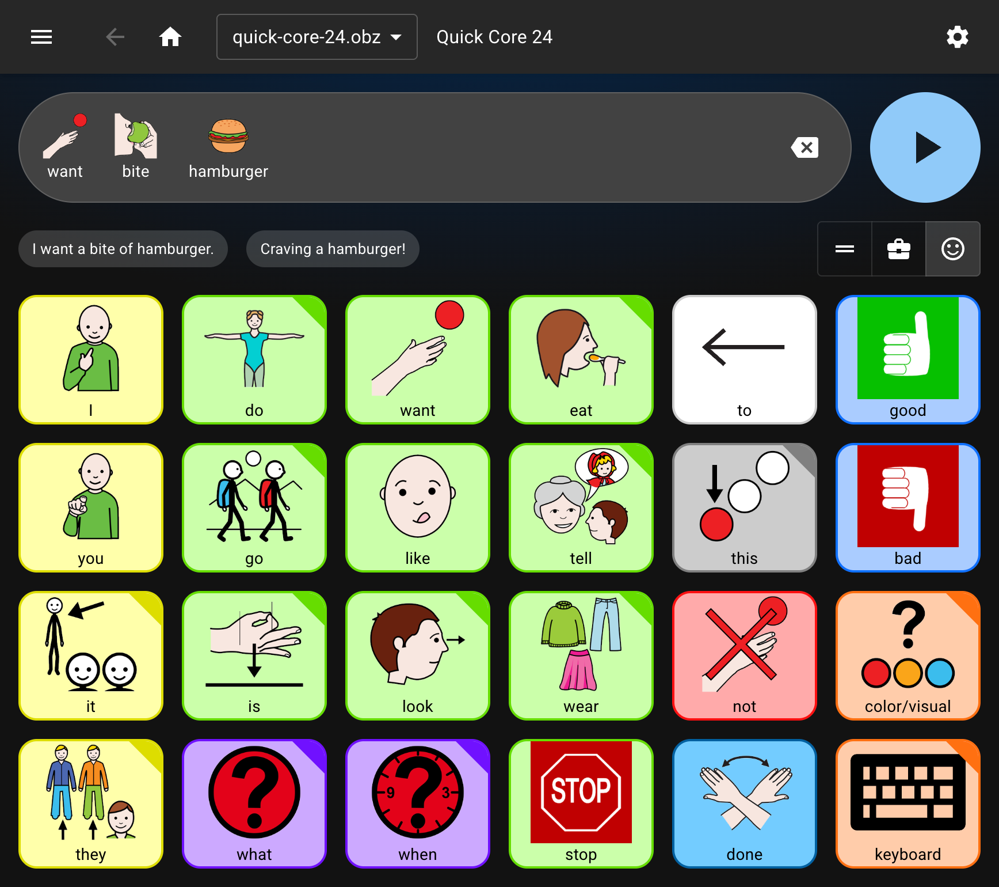

# AAC Board AI

[](https://app.netlify.com/projects/aacboard/deploys)

_Google Chrome Built-in AI Challenge 2025_

## Overview

AAC (Augmentative and Alternative Communication) tools help people who cannot rely on speech communicate through symbols, text, or synthesized voice. These tools often use communication boards — visual grids of pictures or words that users tap to form messages.

**AAC Board AI** brings these boards to life with [Chrome's Built-in AI](https://developer.chrome.com/docs/ai/built-in), adding real-time corrections and tone control so messages feel natural and expressive — all powered locally by Gemini Nano for fast, private, reliable offline communication.



Try the live demo at [aacboard.app](https://aacboard.app). _(requires Chrome 138+ with Built-in AI enabled)_.

## Impact & Motivation

**The Problem:**  
Traditional AAC communication boards help people with speech disabilities express themselves through symbols, but they lack natural language processing. Users tap pictograms to form messages word-by-word, often resulting in grammatically incorrect or contextually inappropriate sentences like "me want drink water" instead of "I want to drink water."

**The Solution:**  
AAC Board AI uses Chrome's Built-in AI to transform pictogram-based messages into natural, grammatically correct sentences with adjustable tone — all processed locally on the user's device for privacy and offline reliability.

**Who Benefits:**
- 🧑 People with cerebral palsy, autism, aphasia, or other speech disabilities
- 👨‍⚕️ Speech-language therapists and AAC specialists
- 👪 Caregivers and family members

**Why Built-in AI Matters:**
- ✅ **Privacy:** All processing happens on-device
- ✅ **Offline:** Works without internet after initial setup
- ✅ **Free:** No API costs or usage limits
- ✅ **Fast:** Real-time corrections with Gemini Nano

**Key Features:**
- **Grammar Correction** – Instantly fixes grammar using the [Proofreader API](https://developer.chrome.com/docs/ai/proofreader-api)
- **Tone Adjustment** – Rewrites phrases for casual, formal, or neutral delivery through the [Rewriter API](https://developer.chrome.com/docs/ai/rewriter-api)
- **Multi-Language Support** – Translates messages seamlessly between languages with the [Translator API](https://developer.chrome.com/docs/ai/translator-api)

## Technical Stack

**Frontend:** React 19 • TypeScript • Vite (with React Compiler)  
**UI:** Material UI 7  
**AI:** Chrome Built-in AI (Gemini Nano)  
**Data:** IndexedDB • Zod schema validation  
**Standards:** Open Board Format (OBF/OBZ) support  
**Voice:** Web Speech API

[Architecture →](src/)

## Quick Start

**Requirements:** Chrome 138+ with Built-in AI flags enabled

Paste each link below into Chrome's address bar, enable the feature, and restart Chrome:

```
chrome://flags/#proofreader-api-for-gemini-nano
chrome://flags/#rewriter-api-for-gemini-nano
```

Then run locally:

```bash
git clone https://github.com/shayc/aac-board-ai.git
cd aac-board-ai
npm install && npm run dev
```

Open [http://localhost:5173](http://localhost:5173)

## References

- [Chrome Built-in AI Docs](https://developer.chrome.com/docs/ai/built-in)
- [Open Board Format](https://www.openboardformat.org/)

## License

[MIT](./LICENSE) — built with ❤️
