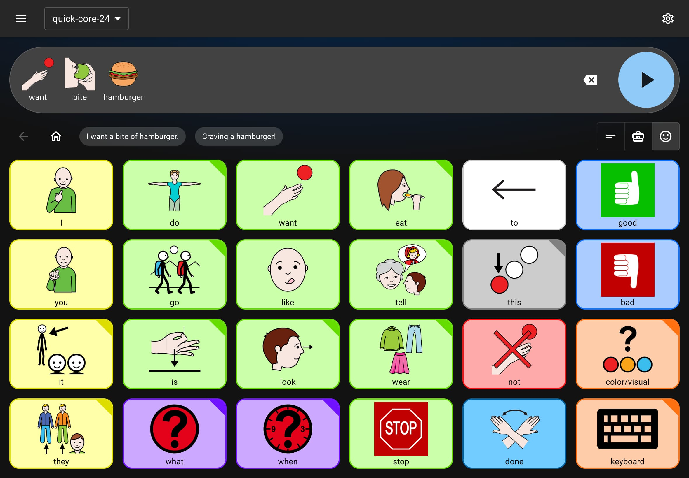

# AAC Board AI

[](https://github.com/shayc/aac-board-ai/actions/workflows/ci.yml)
[](https://app.netlify.com/projects/aacboard/deploys)

**Winner - [Google Chrome Built-in AI Challenge 2025](https://developer.chrome.com/blog/ai-challenge-winners-2025) (Most Helpful Application)**

**AAC Board AI** is an Augmentative and Alternative Communication board that helps people who cannot rely on speech communicate more easily and naturally. It is enhanced with **Built-in AI** for on-device proofreading, rewriting, and board translation — keeping interactions private, fast, and reliable offline.



Try the live demo at [aacboard.app](https://aacboard.app). Core board features work without AI; Built-in AI enhancements require Chrome or Edge with [Built-in AI enabled](#enabling-built-in-ai).

## Key Features

- **Grammar Correction** – Turns telegraphic text into clear sentences ([Proofreader API](https://developer.chrome.com/docs/ai/proofreader-api)).
- **Tone Adjustment** – Rewrites messages in direct, professional, or friendly tones ([Rewriter API](https://developer.chrome.com/docs/ai/rewriter-api)).
- **Translation** – Translates board labels and vocalizations between languages ([Translator API](https://developer.chrome.com/docs/ai/translator-api)).
- **Text to Speech** – Reads messages aloud ([Web Speech API](https://developer.mozilla.org/en-US/docs/Web/API/Web_Speech_API)).
- **Offline Ready** – Installs as a standalone app with automatic updates ([PWA](https://developer.mozilla.org/en-US/docs/Web/Progressive_web_apps)).
- **Open Board Format** – Imports `.obf` and `.obz` files ([examples](https://www.openboardformat.org/examples)).

## Enabling Built-in AI

Grammar correction and tone adjustment require experimental browser flags.

**Chrome:**

```
chrome://flags/#proofreader-api-for-gemini-nano
chrome://flags/#rewriter-api-for-gemini-nano
```

**Edge:**

```
edge://flags/#edge-llm-rewriter-api-for-phi-mini
```

## Quick Start

Requires Node.js 24+.

```bash
git clone https://github.com/shayc/aac-board-ai.git
cd aac-board-ai
npm install && npm run dev
```

Open [http://localhost:5173](http://localhost:5173)

## Development

```bash
npm run dev             # Start dev server
npm run lint            # Lint
npm test                # Run tests
npm run build           # Typecheck + production build
```

## Technical Stack

- **UI:** React 19, TypeScript, Material UI, React Router
- **AI:** Gemini Nano (Chrome) / Phi 4 Mini (Edge)
- **Speech:** Web Speech API
- **Storage:** IndexedDB
- **Data:** open-board-format (OBF/OBZ file parsing)
- **Tooling:** Vite, Vitest, Playwright

See full architecture details in [docs/architecture.md](docs/architecture.md).

## Loading a Board via URL

Load a board by passing an OBF or OBZ file URL as the `board` query parameter:

```
https://aacboard.app/?board=https://example.com/board.obz
```

The app fetches, imports, and navigates to the board automatically.

## References

- [Chrome Built‑in AI](https://developer.chrome.com/docs/ai/built-in)
- [Edge Built‑in AI](https://learn.microsoft.com/en-us/microsoft-edge/web-platform/prompt-api)
- [Open Board Format](https://www.openboardformat.org)

## Contributing

While I'm thrilled if you find this code useful, this repository serves as my personal workspace and I am not accepting pull requests at this time. Feel free to fork the project and adapt it to your own needs under the MIT license.

## License

[MIT](LICENSE) © Shay Cojocaru
