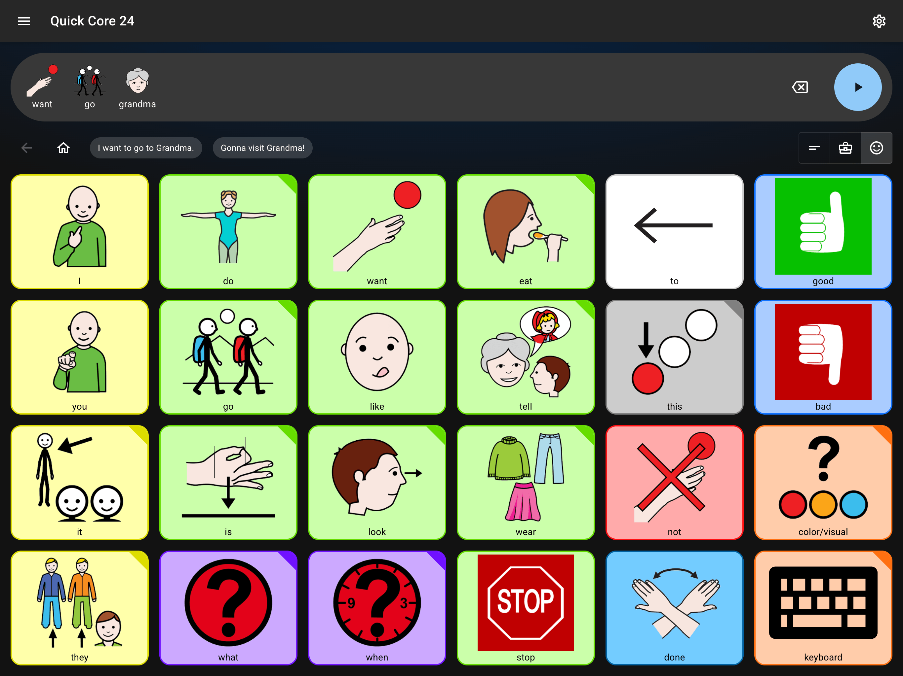

# AAC Board AI

[](https://app.netlify.com/projects/aacboard/deploys)

**Winner - [Google Chrome Built-in AI Challenge 2025](https://developer.chrome.com/blog/ai-challenge-winners-2025) (Most Helpful Application)**

**AAC Board AI** is a communication tool that enables non-verbal users to express themselves naturally. It leverages **Chrome's Built-in AI** for on-device message refinement—including proofreading, rewriting, and translation. Since all processing is local, this architecture guarantees both user **privacy** and reliable **offline functionality**.



Try the live demo at [aacboard.app](https://aacboard.app). _(requires
Chrome 138+ with [Built‑in AI flags enabled](#prerequisites))_.

## Overview

Many AAC (Augmentative and Alternative Communication) tools rely on
pictogram-based boards that produce short, telegraphic phrases. AAC Board AI
reduces the effort required to communicate: as the user taps symbols, it
generates **full, natural sentences** in real time using Chrome’s on-device AI.

## Key Features

- **Grammar Correction** – Turns short, telegraphic text
  into clear, natural sentences ([Proofreader API](https://developer.chrome.com/docs/ai/proofreader-api)).
- **Tone Adjustment** – Rewrites messages into casual, polite, or
  formal tones ([Rewriter API](https://developer.chrome.com/docs/ai/rewriter-api)).
- **Multi-Language Support** – Translates messages between languages ([Translator API](https://developer.chrome.com/docs/ai/translator-api)).

## Prerequisites

Requires **Chrome 138+** with Built‑in AI flags enabled.

Enable the following flags and relaunch Chrome:

```
chrome://flags/#proofreader-api-for-gemini-nano
```

```
chrome://flags/#rewriter-api-for-gemini-nano
```

## Quick Start

```bash
git clone https://github.com/shayc/aac-board-ai.git
cd aac-board-ai
npm install && npm run dev
```

Open http://localhost:5173

## Technical Stack

**Frontend**

- React 19 + React Compiler
- TypeScript 5.9
- Material UI 7
- React Router 7

**AI Processing**

- Chrome Built-in AI (Gemini Nano)

**Audio Output**

- Web Speech API (SpeechSynthesis)

**Data & Storage**

- IndexedDB (idb)
- Zod (Open Board Format validation)
- fflate (OBZ extraction)

**Build & Dev**

- Vite 7
- Vitest + Playwright

See full architecture details in
[docs/architecture.md](docs/architecture.md).

## Example Boards

Download and import example boards from:
https://www.openboardformat.org/examples

## References

- Chrome Built‑in AI Docs:
  https://developer.chrome.com/docs/ai/built-in
- Open Board Format: https://www.openboardformat.org/

## License

[MIT](LICENSE)
