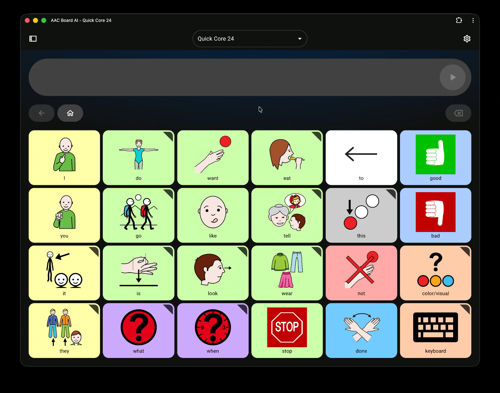

<div align="center">

# AAC Board AI

**Winner of the [Google Chrome Built-in AI Challenge 2025](https://developer.chrome.com/blog/ai-challenge-winners-2025) — Most Helpful Application**

**[Try AAC Board AI](https://aacboard.app)**

[](https://github.com/shayc/aac-board-ai/actions/workflows/ci.yml)

</div>

**AAC Board AI** is a local-first Augmentative and Alternative Communication (AAC) board for people who cannot rely on speech. It helps users build messages with communication symbols and speak them aloud.

On supported browsers, **Built-in AI** uses the browser’s on-device models to proofread messages, adjust tone, and translate boards. No API key or cloud AI service is required, and core communication works without Built-in AI.



## From a few symbols to a clearer message

AAC users may select a few key concepts rather than every word in a complete sentence:

```text
Selected tiles:  [ want ] → [ eat ] → [ pizza ]
Raw message:     "want eat pizza"
AI suggestion:   "I want to eat pizza."
```

Suggestions are optional; the original message is replaced only when the user accepts one.

## Built-in AI where it matters

| Browser API                                                         | What it offers the user                                                           |
| ------------------------------------------------------------------- | --------------------------------------------------------------------------------- |
| [Proofreader](https://developer.chrome.com/docs/ai/proofreader-api) | Grammar, spelling, and punctuation corrections                                    |
| [Rewriter](https://developer.chrome.com/docs/ai/rewriter-api)       | Alternative phrasing that preserves the original tone or adopts a more casual one |
| [Translator](https://developer.chrome.com/docs/ai/translator-api)   | Translated board names, labels, and spoken phrases                                |

## A complete board, with or without AI

- **Starter board** — Includes the Quick Core 24 board with linked vocabulary categories.
- **Accessible input** — Supports touch and keyboard navigation.
- **Open boards** — Imports `.obf` and `.obz` [Open Board Format](https://www.openboardformat.org) files from your device or a URL.
- **Multilingual** — Supports 35 interface languages, right-to-left layouts, and on-device caching for translated boards.
- **Offline and installable** — Runs as a PWA and keeps loaded boards available without a connection.

## Privacy, offline use, and current limits

AAC Board AI has no accounts, backend, telemetry, or tracking. Imported boards, settings, and cached translations stay on the device; messages are never sent to an AAC Board AI server.

After the first successful load, the app and loaded boards work offline. URL imports require a connection, and text-to-speech support depends on the platform and its available voices.

Boards can be imported and stored, but not edited, exported, or synchronized between devices. Prepare custom boards with an Open Board Format-compatible tool and import them on each device.

## Built-in AI compatibility

The app checks for Built-in AI support at runtime. Availability depends on the browser, operating system, hardware, language, and downloaded models; initial model or language-pack downloads may require an unmetered connection.

- **Google Chrome:** [Proofreader](https://developer.chrome.com/docs/ai/proofreader-api), [Rewriter](https://developer.chrome.com/docs/ai/rewriter-api), and [Translator](https://developer.chrome.com/docs/ai/translator-api)
- **Microsoft Edge:** [Proofreader](https://learn.microsoft.com/en-us/microsoft-edge/web-platform/proofreader-api), [Rewriter](https://learn.microsoft.com/en-us/microsoft-edge/web-platform/writing-assistance-apis), and [Translator](https://learn.microsoft.com/en-us/microsoft-edge/web-platform/translator-api)

## Develop locally

Requires Node.js 24+.

```bash
git clone https://github.com/shayc/aac-board-ai.git
cd aac-board-ai
npm install
npm run dev
```

Open [http://localhost:5173](http://localhost:5173).

```bash
npx playwright install --with-deps  # Install browser test dependencies
npm run lint                        # Lint the code
npm test                            # Run the tests in Chromium
npm run build                       # Type-check and build for production
```

## Architecture

AAC Board AI is built with React 19, the React Compiler, TypeScript, Material UI, React Router, IndexedDB, Vite, Vitest, and Playwright. See [docs/architecture.md](docs/architecture.md) for the design, module boundaries, storage model, and accessibility invariants.

## Contributing

Bug reports and feedback are welcome. Pull requests are not accepted.

## License

[MIT](LICENSE) © Shay Cojocaru

The bundled Quick Core 24 board is by [OpenAAC](https://www.openaac.org) and licensed under [CC BY 4.0](https://creativecommons.org/licenses/by/4.0/).
