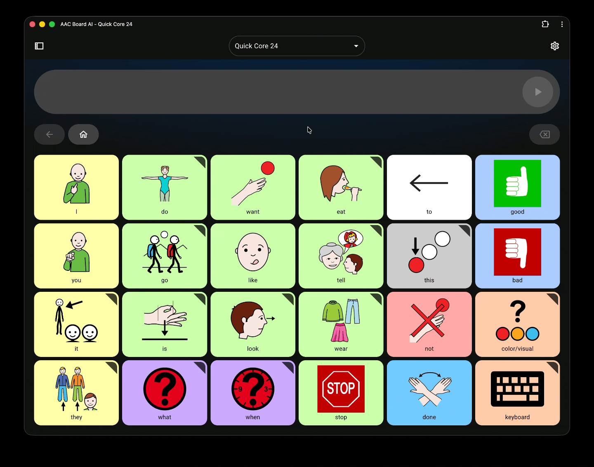

<div align="center">

# AAC Board AI

**Winner of the [Google Chrome Built-in AI Challenge 2025](https://developer.chrome.com/blog/ai-challenge-winners-2025) — Most Helpful Application**

**[Try AAC Board AI](https://aacboard.app)**

[](https://github.com/shayc/aac-board-ai/actions/workflows/ci.yml)

</div>

**AAC Board AI** is a local-first augmentative and alternative communication (AAC) app for people who cannot rely on speech. Users select symbols to build messages and speak them aloud.

On supported browsers, **Built-in AI** uses the browser’s on-device models to proofread messages, rewrite them, and translate board content. No API key or cloud AI service is required, and core communication works without Built-in AI.



## From tiles to a sentence

```text
Selected tiles:  [ want ] → [ eat ] → [ pizza ]
Board message:   "want eat pizza"
AI suggestion:   "I want to eat pizza."
```

Suggestions are optional and replace the original message only when accepted.

## Core features

- Quick Core 24 starter board with linked vocabulary
- Touch and keyboard navigation
- Import [Open Board Format](https://www.openboardformat.org) files (`.obf` and `.obz`) from your device or a URL
- 35 interface languages, including right-to-left layouts
- Installable PWA with offline communication

## Privacy and offline use

AAC Board AI has no accounts, backend, telemetry, or tracking. Boards, messages, settings, and cached translations stay on the device. Loading third-party media contacts external hosts.

Stored boards remain available offline. URL imports and remote resources require a connection. Offline speech availability depends on the device and selected voice.

## Limitations

The app supports importing and storing boards. Editing, exporting, and cross-device sync are not available. To create a custom board, use an Open Board Format-compatible tool, then import it on each device.

## Built-in AI availability

Support varies by browser, device, language, and model availability.

Proofreading and rewriting currently require experimental browser flags:

**Google Chrome**

```text
chrome://flags/#proofreader-api
chrome://flags/#rewriter-api
```

**Microsoft Edge**

```text
edge://flags/#edge-proofreader-api
edge://flags/#edge-llm-rewriter-api-for-phi-mini
```

Enable the flags and restart your browser. See the API documentation for current requirements:

- **Google Chrome:** [Proofreader](https://developer.chrome.com/docs/ai/proofreader-api) · [Rewriter](https://developer.chrome.com/docs/ai/rewriter-api) · [Translator](https://developer.chrome.com/docs/ai/translator-api)
- **Microsoft Edge:** [Proofreader](https://learn.microsoft.com/en-us/microsoft-edge/web-platform/proofreader-api) · [Rewriter](https://learn.microsoft.com/en-us/microsoft-edge/web-platform/writing-assistance-apis) · [Translator](https://learn.microsoft.com/en-us/microsoft-edge/web-platform/translator-api)

## Develop locally

Requires Node.js 24+.

```bash
git clone https://github.com/shayc/aac-board-ai.git
cd aac-board-ai
npm install
npm run dev
```

Open [http://localhost:5173](http://localhost:5173).

Tests run in Chromium; install Playwright with `npx playwright install --with-deps`, then run `npm test`.

## Architecture

See [docs/architecture.md](docs/architecture.md) for the stack, module boundaries, storage model, and accessibility invariants.

## Contributing

Bug reports and feedback are welcome. With a single maintainer, the project currently has limited capacity for code contributions.

## License

[MIT](LICENSE) © Shay Cojocaru

The bundled Quick Core 24 board is by [OpenAAC](https://www.openaac.org) and licensed under [CC BY 4.0](https://creativecommons.org/licenses/by/4.0/).
