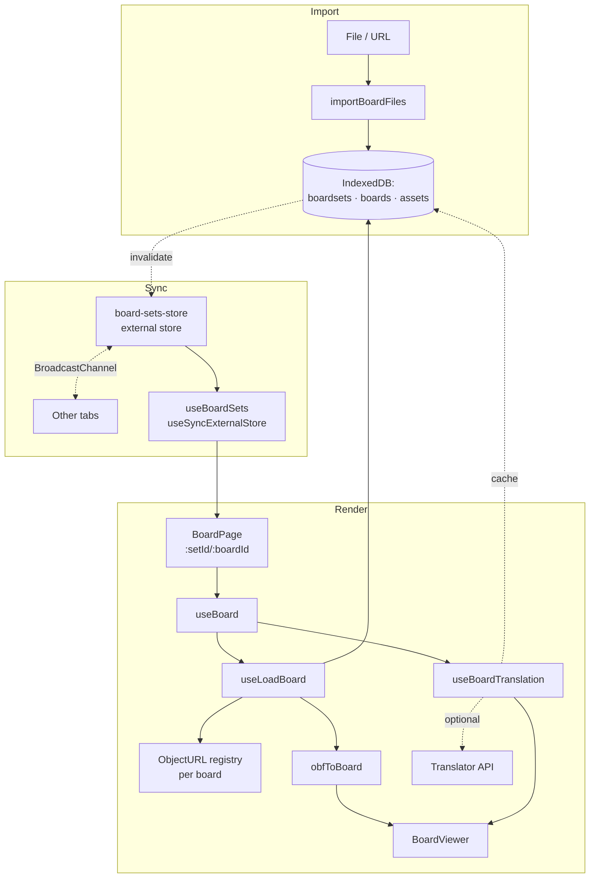

# Architecture

> **Audience:** contributors and coding agents making non-trivial changes to this repo. For a project introduction, see the [README](../README.md).

## 1. System overview

A client-side React 19 app that renders [Open Board Format](./third-party/open-board-format.md) communication boards from an in-browser IndexedDB store. Imported `.obf` / `.obz` files are parsed and persisted; boards are loaded on demand, optionally translated through the browser's Built-in AI Translator, and rendered as a keyboard-navigable tile grid that drives a message strip with text-to-speech playback. There is no backend — every byte stays on the device.

Built-in AI is a **leaf-level enhancement**, not the architecture: when available, it adds proofreading and rewriting suggestions to the message strip and translation to board labels. Everything else works without it.

## 2. Module boundaries

The codebase is **feature-sliced**. The single feature today is `board`. Layers and import rules:

- `@app/*` — app shell, providers, routing, top-level dialogs/drawers.
- `@features/*` — self-contained feature modules. May import from `@shared/*`. Must **not** import from `@app/*` or from each other.
- `@pages/*` — route components. Compose features and shared UI.
- `@shared/*` — cross-cutting code (AI capability hooks, speech, language, snackbar, theme, utilities). No knowledge of features.

Aliases are declared in [tsconfig.app.json](../tsconfig.app.json) and mirrored in [vite.config.ts](../vite.config.ts).

**Public-barrel rule.** UI layers consume the board feature through [`@features/board`](../src/features/board/index.ts). Reaching into `storage/`, `obf/`, or other internals from outside the feature is disallowed by convention. The barrel exposes `BoardViewer`, `useBoard`, `useBoardSets`, `useImportBoardFiles`, and the imperative store functions (`getBoardSets`, `importBoardFromUrl`, `removeBoardSet`).

**See:** [tsconfig.app.json](../tsconfig.app.json), [src/features/board/index.ts](../src/features/board/index.ts).

## 3. Routing

Single React Router `BrowserRouter`. All routes share `<AppShell>` (header, drawers, onboarding dialog, `<Outlet>`).

| Path                           | Component              | Lazy | Notes                                               |
| ------------------------------ | ---------------------- | ---- | --------------------------------------------------- |
| `/`                            | `HomePage`             | no   | Resolves initial board; honors `?board=<url>` query |
| `/sets/:setId`                 | `BoardSetRootRedirect` | no   | Redirects to the set's root board                   |
| `/sets/:setId/boards/:boardId` | `BoardPage`            | yes  | The board renderer                                  |
| `/library`                     | `LibraryPage`          | yes  | Browse, import, delete board sets                   |
| `/about`                       | `AboutPage`            | yes  | Static content                                      |

Lazy routes are wrapped in `<AsyncBoundary>` (`<Suspense>` + `react-error-boundary`). Board-to-board navigation goes through `useBoardNavigation`, which carries a `backStack: string[]` on `location.state` for a board-aware back button distinct from browser history.

**See:** [src/app/app-routes.tsx](../src/app/app-routes.tsx), [src/shared/components/async-boundary.tsx](../src/shared/components/async-boundary.tsx), [src/features/board/navigation/use-board-navigation.ts](../src/features/board/navigation/use-board-navigation.ts).

## 4. App shell

`<AppShell>` is the layout shared by every route. It renders the header, hosts the menu and settings drawers, mounts the onboarding dialog, and renders an `<Outlet>` for the active page.

**Onboarding.** `OnboardingDialog` opens on first visit, gated by the `hasSeenOnboarding` localStorage key through `useOnboarding`. Dismissal sets the flag; the dialog never appears again on that device.

**Snackbar.** `SnackbarProvider` exposes `showSnackbar({ message, severity })` via `useSnackbar()`. Today it surfaces import success/failure (`useImportBoardFiles`) and board-set deletion outcomes (`LibraryPage`). Other transient feedback should go through the same channel rather than rolling its own UI.

**Settings drawer.** `SettingsDrawer` composes four panels from `src/app/drawers/settings/`: `AppearanceSettings`, `LanguageSettings`, `SpeechSettings`, `AISettings`. Add a setting by adding a panel.

**See:** [src/app/layouts/app-shell.tsx](../src/app/layouts/app-shell.tsx), [src/app/dialogs/use-onboarding.ts](../src/app/dialogs/use-onboarding.ts), [src/shared/snackbar/snackbar-provider.tsx](../src/shared/snackbar/snackbar-provider.tsx), [src/app/drawers/settings/settings-drawer.tsx](../src/app/drawers/settings/settings-drawer.tsx).

## 5. Provider stack

`AppProviders` composes context in this order, outer to inner:

```
LanguageProvider               // language preference + default voice selection
└─ ThemeProvider               // MUI theme + RTL direction
   └─ SnackbarProvider         // queued transient feedback
```

There is no provider for speech state or AI state. Speech is owned by a module-level [speech-store](../src/shared/speech/speech-store.ts) — `LanguageProvider` reads voices from it via `useVoices()` to pick a default for the current language. Built-in AI state is owned per-hook and aggregated via [`useDownloadProgress`](../src/shared/built-in-ai/use-download-progress.ts), which subscribes to a module-level progress store. Both follow the same pattern: singleton browser state lives in a module store, not in a React context, so updates only re-render the components subscribed to the slice that changed.

**See:** [src/app/app-providers.tsx](../src/app/app-providers.tsx), [src/shared/language/language-provider.tsx](../src/shared/language/language-provider.tsx).

## 6. Data flow

The end-to-end pipeline from imported file to spoken message:



IndexedDB is the convergence point: it's written by import, read by board loading, and re-read after translation caches its results. The board-sets external store is invalidated whenever import or delete completes, and a `BroadcastChannel` propagates the invalidation to every open tab. From `BoardViewer`, tile activations flow through `useButtonActivation` into `useMessage` (localStorage) and `useBoardNavigation`; per-button preview plays directly through `speak()` from the speech-store / `useAudio`, while the message-bar play button uses `useMessagePlayback` — see Speech & audio for playback and Storage for persistence.

**See:** [src/features/board/storage/board-import.ts](../src/features/board/storage/board-import.ts), [src/features/board/storage/board-sets-store.ts](../src/features/board/storage/board-sets-store.ts), [src/features/board/use-load-board.ts](../src/features/board/use-load-board.ts), [src/features/board/use-board-translation.ts](../src/features/board/use-board-translation.ts), [src/features/board/use-button-activation.ts](../src/features/board/use-button-activation.ts).

## 7. Storage

Three layers, by lifetime.

### IndexedDB

Database `aac-boards-db`, version 1.

| Object store | Key                | Indexes                        | Holds                                      |
| ------------ | ------------------ | ------------------------------ | ------------------------------------------ |
| `boardSets`  | `setId`            | `byUpdatedAt`                  | `BoardSetRecord` — metadata per import     |
| `boards`     | `[setId, boardId]` | `bySetId`                      | `BoardRecord` — the OBF JSON for one board |
| `assets`     | `[setId, path]`    | `bySetId`, `bySetIdAndMediaId` | `AssetRecord` — image/sound `Blob`s        |

Access goes through helpers in `boards-db.ts`. `withBoardsDB(operation)` opens the DB, runs the callback, and closes — connections are not pooled. Deletes use bound `IDBKeyRange` to remove all rows for a `setId` in a single transaction.

### localStorage

Via `usePersistentState`.

| Key                 | Holds                                  | Owner                                                                                 |
| ------------------- | -------------------------------------- | ------------------------------------------------------------------------------------- |
| `language`          | Selected primary language subtag       | [LanguageProvider](../src/shared/language/language-provider.tsx)                      |
| `message`           | Current `MessagePart[]` (draft)        | [useMessage](../src/features/board/message/use-message.ts)                            |
| `ai-shared-context` | User-supplied free-text custom prompt  | [useCustomInstructions](../src/features/board/suggestions/use-custom-instructions.ts) |
| `hasSeenOnboarding` | Boolean — has the welcome dialog shown | [useOnboarding](../src/app/dialogs/use-onboarding.ts)                                 |

### React Context

Runtime only.

| Context              | Provides                                                 |
| -------------------- | -------------------------------------------------------- |
| `ThemeContext` (MUI) | Theme; consumed via `sx` callbacks, no custom `useTheme` |
| `SnackbarContext`    | `showSnackbar` + queued `<Snackbar>` UI                  |
| `SpeechContext`      | Voices, locales, rate/pitch/volume, `speak`/`cancel`     |
| `LanguageContext`    | Available languages, selected language, `setLanguage`    |

**Cross-tab sync.** `board-sets-store.ts` builds an external store with `createExternalStore` (a tiny `Set<listener>` + state) and exposes it through `useBoardSets` via `useSyncExternalStore`. Mutations call `invalidateAndBroadcast`, which refreshes the local snapshot and posts to a `BroadcastChannel("board-sets-sync")`; other tabs receive the message and refresh their own snapshots.

**ObjectURL lifecycle.** `useLoadBoard` allocates a fresh `ObjectUrlRegistry` per load and `revokeAll()`s the previous one on success or unmount, preventing blob-URL leaks across navigations.

**See:** [src/features/board/storage/boards-db.ts](../src/features/board/storage/boards-db.ts), [src/features/board/storage/board-sets-store.ts](../src/features/board/storage/board-sets-store.ts), [src/shared/utils/external-store.ts](../src/shared/utils/external-store.ts), [src/shared/utils/object-url.ts](../src/shared/utils/object-url.ts), [src/shared/hooks/use-persistent-state.ts](../src/shared/hooks/use-persistent-state.ts).

## 8. AI integration

The app adapts to the browser's capabilities, not its version. There is no hard-coded minimum version.

- **Always works:** board rendering, navigation, message composition, text-to-speech (Web Speech API), board import, offline use.
- **Enhanced when available** — each capability is detected at module load (`"X" in self`); UI components condition on the matching boolean and the affordance is hidden when missing, never broken:
  - **Translator API** → translates board labels into the user's language and caches the result.
  - **Rewriter API** → tone-adjusted phrase suggestions in `SuggestionBar`.
  - **Proofreader API** → grammar/spelling correction suggestions in `SuggestionBar`.

For instructions to enable Built-in AI in supported browsers, see [Enabling Built-in AI](../README.md#enabling-built-in-ai).

### Capability detection

[`isSupported(name)`](../src/shared/built-in-ai/is-supported.ts) returns whether the matching global (`"Translator"`, `"Rewriter"`, `"Proofreader"`) is present on `self`. Called directly by `AISettings`, `LanguageSettings`, and `useSuggestions` to gate the AI affordances at render time. Combine with the hook's `status === "unavailable"` for the full readiness picture.

### Session caching

Each AI hook (`useProofreader`, `useRewriter`, `useTranslator`) holds a single live session in a `useRef`. Subsequent calls reuse that session unless the relevant options change (language pair for translator, tone/format/length/sharedContext for rewriter). This avoids paying creation cost — including model download — on every keystroke.

### Download-progress aggregation

Built-in AI sessions emit `downloadprogress` events during model download. The lifecycle store in [internal/lifecycle/store.ts](../src/shared/built-in-ai/internal/lifecycle/store.ts) forwards each event to a module-level [progress-store](../src/shared/built-in-ai/internal/progress-store.ts) keyed by namespace. [`useDownloadProgress(namespace?)`](../src/shared/built-in-ai/use-download-progress.ts) reads the highest in-flight value via `useSyncExternalStore`, aggregating downloads triggered by hooks and the imperative `create*` factories alike. `LanguageSettings` and `SpeechSettings` consume `useDownloadProgress("Translator")` to render their progress messages.

### Where `sharedContext` is actually used

The persisted `ai-shared-context` string is currently passed only through `useSuggestions` into `createRewriter({ sharedContext })`. The translator and proofreader hooks do not consume it today.

### Suggestions composition

`useSuggestions` runs the proofreader and rewriter in parallel against a shared `AbortController`, cancels in-flight calls when the input changes, dedupes results, and filters out low-quality outputs (entries with underscored tokens or stray quote marks).

**See:** [src/shared/built-in-ai/](../src/shared/built-in-ai/) (module overview in its [README](../src/shared/built-in-ai/README.md)), [src/shared/built-in-ai/is-supported.ts](../src/shared/built-in-ai/is-supported.ts), [src/shared/built-in-ai/use-download-progress.ts](../src/shared/built-in-ai/use-download-progress.ts), [src/shared/built-in-ai/translator/use-translator.ts](../src/shared/built-in-ai/translator/use-translator.ts), [src/shared/built-in-ai/rewriter/use-rewriter.ts](../src/shared/built-in-ai/rewriter/use-rewriter.ts), [src/shared/built-in-ai/proofreader/use-proofreader.ts](../src/shared/built-in-ai/proofreader/use-proofreader.ts), [src/features/board/suggestions/use-suggestions.ts](../src/features/board/suggestions/use-suggestions.ts).

## 9. Speech & audio

Two engines play message parts:

- **[`speech-store`](../src/shared/speech/speech-store.ts)** — module-level external store wrapping the Web Speech API. Holds the voice list (refreshed on `voiceschanged`) and per-utterance rate/pitch/volume. Exposes imperative actions (`speak`, `cancel`, `pause`, `resume`, `setRate`, `setPitch`, `setVolume`, `setVoiceURI`) and slice-subscribed hooks (`useVoices`, `useVoiceURI`, `useRate`, `usePitch`, `useVolume`). Actions are module exports, so their identity is permanently stable.
- **`useAudio`** — plays an OBF sound asset (already a blob URL from the ObjectURL registry) one at a time; `play()` returns a promise that resolves on `ended` or rejects when `stop()` is called.

`useMessagePlayback` interleaves them: it walks each `MessagePart` in order; if the part has a `soundSrc`, it plays the audio; otherwise it speaks the `vocalization ?? label` via `speak()`. Adjacent text parts are merged into a single utterance to avoid clipped speech between words.

**Slice-stable snapshot.** The store's snapshot pre-computes a `voicesView` object holding `voices` / `locales` / `voicesByLanguage` / `voicesByLocale`. Setting `voiceURI` / `rate` / `pitch` / `volume` produces a new snapshot but preserves the existing `voicesView` reference, so `useVoices()` consumers don't re-render on settings changes. This is what keeps `LanguageProvider` (which only reads voices) from re-rendering during utterances or slider drags — and by extension keeps the board from re-rendering through `useLanguage()`.

**See:** [src/shared/speech/speech-store.ts](../src/shared/speech/speech-store.ts), [src/shared/hooks/use-audio.ts](../src/shared/hooks/use-audio.ts), [src/features/board/message/use-message-playback.ts](../src/features/board/message/use-message-playback.ts).

## 10. Internationalization

Both [OBF](./third-party/open-board-format.md) (`board.locale`) and the Web Speech API (`voice.lang`) use [BCP-47](https://www.rfc-editor.org/info/bcp47) tags. The app splits them into two roles:

| Term       | Meaning                              | Examples          |
| ---------- | ------------------------------------ | ----------------- |
| `locale`   | Full BCP-47 tag (language + region). | `"en"`, `"en-US"` |
| `language` | Primary subtag only.                 | `"en"`, `"pt"`    |

Helpers in [src/shared/language/locale.ts](../src/shared/language/locale.ts): `normalizeLocaleCode` (canonical casing) and `getPrimaryLanguage` (locale → language).

### Translation caching

When the user's selected language differs from a board's locale, `useBoardTranslation`:

1. Checks `board.strings[language]` for an existing translation. If present, applies it and stops.
2. Otherwise, creates a `Translator` for the language pair, translates every label and vocalization in parallel, and applies the result to a derived `Board`.
3. Persists the translated dictionary back into the OBF JSON via `updateBoardStrings`, so subsequent loads (this session or any future one, in any tab) hit the cache instead of the AI.

If the Translator capability is unavailable, the original board is shown unchanged.

**See:** [src/features/board/use-board-translation.ts](../src/features/board/use-board-translation.ts), [src/features/board/storage/boards-db.ts](../src/features/board/storage/boards-db.ts).

## 11. PWA & offline

Powered by `vite-plugin-pwa`:

- **Installable** on desktop and mobile.
- **Auto-updating** service worker (`registerType: "autoUpdate"`) — the latest build loads without user action.
- **Offline-capable** — after the first visit, all app assets are served from the service worker cache. Imported board sets and assets are already in IndexedDB, so the app remains fully functional without a network.

Configuration lives in [vite.config.ts](../vite.config.ts) under the `VitePWA()` plugin.
