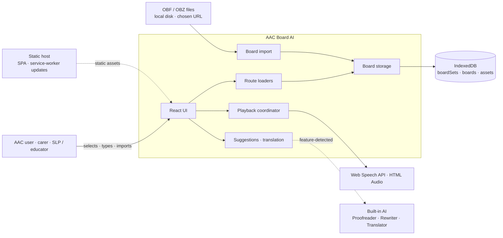

# Architecture

> **TL;DR** — AAC Board AI is a device-local PWA for augmentative and
> alternative communication. Open Board Format boards live in IndexedDB;
> selecting tiles builds a message that the browser can speak. Optional Built-in
> AI can refine or translate text without an application backend. **No
> application backend, telemetry, or tracking.**
>
> New here? The board domain lives under `src/features/board/`; start with
> `board-viewer.tsx`.

This document describes the app's modules, ownership boundaries, invariants, and
load-bearing decisions. Setup and commands live in `README.md` and `AGENTS.md`;
code style lives in `AGENTS.md`; symbol-level behavior lives beside the code.
The intended audience is contributors familiar with React, TypeScript, and the
Web Platform. AAC terms are defined in the [glossary](#glossary).

**Quality goals, in order:**

1. **Accessibility** — communication must remain available to users who cannot
   rely on speech or a single input method.
2. **Offline reliability** — the core board path must work without a network.
3. **Privacy** — no application service receives board or message content.
4. **Responsiveness** — tile activation must feel immediate.
5. **Internationalization** — supported languages and text directions must work
   consistently across UI, boards, and speech.

## Purpose and constraints

The app gives someone who cannot rely on speech a fast way to compose and speak
a message by selecting tiles that contain communication symbols. Optional
on-device models can turn short, telegraphic input such as "want eat pizza
later" into more natural language.

Two constraints shape the architecture:

- **Device-local core.** IndexedDB is the source of truth for imported boards.
  Reading, composing, navigating, and speaking a board do not require a network.
  AI, translation, and URL import are progressive enhancements.
- **No application backend.** A static host serves the SPA and service-worker
  updates, but no application server stores user content. Cross-device sync is
  therefore outside the current architecture.

## Runtime architecture

The app is one React SPA. Browser APIs provide persistence and output; feature
modules isolate the board domain, imports, playback, and optional AI. A
`vite-plugin-pwa` service worker caches the app shell after a successful first
load, and the manifest registers `.obf` and `.obz` file handlers.

Dashed edges are outside the core communication path. Built-in AI is detected by
capability rather than User-Agent, and the service worker updates independently
of board use.

### Open a board

React Router loaders prepare the active board before its route renders:

1. Navigate to `/sets/:setId/boards/:boardId`.
2. `hydrateBoard` reads raw OBF and asset blobs, creates provisional media
   object URLs, and maps the result through `obfToBoard` into the in-memory
   `Board`.
3. `resolveTranslatedBoard` uses an existing translation or attempts an optional
   translation. Success is applied immediately and cached with a best-effort,
   asynchronous IndexedDB write; failure returns the untranslated board.
4. Render the grid with a ready `Board`; the route-lifetime observer commits its
   media and releases the prior board. An aborted load releases only its own
   provisional media.

### Activate a tile

Every activation becomes a typed intent before it changes state or produces
output:

1. A tile activation goes through `resolveButtonIntents`, yielding `navigate`,
   `composeAndPlay`, or `runAction`.
2. `activateButton` dispatches the intents by updating the message, navigating,
   or submitting playable content.
3. The board playback adapter calls `planPlayback`; the app-wide playback
   coordinator serializes speech and recorded audio and publishes progress for
   per-part highlighting.

## Codemap and ownership seams

The repository has three enforced module boundaries:

- `src/shared/` is the leaf layer. It does not import from the app, pages, or
  features.
- Each directory directly under `src/features/` is an isolated feature. A
  feature imports shared code and its own relative modules, but not the app,
  pages, or another feature.
- `src/app/` and `src/pages/` compose features through their public entry points,
  such as `src/features/board/index.ts`, rather than importing feature internals.

Directories inside `src/features/board/` are cohesion areas within one feature,
not independent modules. They group code that changes together and may
collaborate through relative imports; they do not need individual barrels or
enforced dependency rules. Some still carry important ownership invariants —
for example, `storage/` exclusively owns IndexedDB access — but a folder alone
does not imply an independently replaceable boundary.

The table identifies the owner of each concern and the rule at its ownership
seam. Names are symbol-searchable rather than hyperlinked so file moves do not
break the map.

| Concern                   | Owner                                                                                                   | Ownership rule                                                                                                                                                                |
| ------------------------- | ------------------------------------------------------------------------------------------------------- | ----------------------------------------------------------------------------------------------------------------------------------------------------------------------------- |
| Composition               | `src/main.tsx`, `src/app/`, `src/pages/`                                                                | `AppProviders` and the router assemble features; pages are route entry components.                                                                                            |
| Active-board data         | `src/app/routing/loaders/`                                                                              | The active board enters the render tree through `boardLoader`; ancillary summaries may use feature hooks.                                                                     |
| Board domain              | `src/features/board/`                                                                                   | `board-viewer.tsx` orchestrates the grid, activation, message, navigation, keyboard, scanning, suggestions, and playback adapters.                                            |
| OBF runtime mapping       | `src/features/board/obf/`                                                                               | `obfToBoard` and `parseAction` define how imported OBF becomes the in-memory domain model.                                                                                    |
| Board ingestion           | `src/features/board/import/`                                                                            | Picker, drag-drop, `?board=` URL, and PWA file-handler inputs converge on `importBoardSets` before storage writes.                                                            |
| Board persistence         | `src/features/board/storage/`                                                                           | This is the only production reader/writer of IndexedDB. Schema changes belong in the `idb` upgrade path.                                                                      |
| Board-set catalog         | `src/features/board/board-sets/`                                                                        | An external store projects IndexedDB metadata into a reactive, cross-tab catalog.                                                                                             |
| Board playback            | `src/features/board/playback/`                                                                          | Converts message parts into playback steps and owns board-specific tracking and UI adapters; device output remains delegated to shared playback.                              |
| Optional language help    | `src/features/board/suggestions/`, `src/features/board/translation/`, `src/shared/built-in-ai/`         | Features consume `@shayc/react-built-in-ai`; shared code owns app policy such as warm-up, context, and engine language options. Every call must tolerate unavailable engines. |
| Playback output           | `src/shared/playback/`                                                                                  | The only gateway to Web Speech and HTML Audio. Playback is single-flight; a new request interrupts the current request without surfacing an error to the user.                |
| Voices                    | `src/shared/speech/`                                                                                    | Owns voice discovery, persisted speech configuration, and voice-language synchronization; it does not produce output.                                                         |
| Language and presentation | `src/shared/language/`, `src/shared/theme/`, `src/shared/playback-highlight/`, `src/shared/tile-color/` | Own the active language, direction, theme, playback highlighting, and board color presentation. UI text comes from Paraglide messages.                                        |
| Switch access             | `src/app/settings/switch-scanning/`, `src/shared/switch-scanning/`, `src/features/board/scanning/`      | App settings own the configuration UI; shared code owns persisted input profiles and engine setup; the board registers existing controls as scan groups and targets.          |
| Shared state primitives   | `src/shared/utils/external-store.ts`, `src/shared/utils/persisted-store.ts`                             | Cross-cutting stores build on these primitives instead of defining new subscription or localStorage machinery.                                                                |
| UI messages               | `messages/*.json`, `project.inlang/`                                                                    | Message sources compile through Paraglide into generated `src/paraglide/`; generated files are never edited manually.                                                         |

External packages carry three integration seams:
`@shayc/open-board-format` parses OBF/OBZ,
`@shayc/react-built-in-ai` wraps browser AI APIs, and
`@shayc/switch-scanning` provides the scanning engine. App modules add product
policy around those package interfaces.

## Data and state model

State has five lifetimes, each with one owner:

| Kind                         | Home                                           | Includes                                                                                                                                                                                      |
| ---------------------------- | ---------------------------------------------- | --------------------------------------------------------------------------------------------------------------------------------------------------------------------------------------------- |
| Durable board data           | IndexedDB via `src/features/board/storage/`    | `boardSets` metadata, raw `OBFBoard` records, and image/sound asset blobs.                                                                                                                    |
| Navigation data              | React Router loaders                           | The hydrated, optionally translated active `Board` for each navigation.                                                                                                                       |
| Reactive cross-cutting state | `createExternalStore` + `useSyncExternalStore` | Board-set catalog, TTS voice catalog, and active playback coordinator.                                                                                                                        |
| Persisted settings           | `createPersistedStore` + localStorage          | Language, speech, highlighting, tile presentation, switch scanning, AI context, and onboarding state. MUI theme mode persists separately as `mui-mode` and is read pre-paint in `index.html`. |
| Ephemeral interaction state  | Local React state                              | In-progress message parts and remembered grid focus.                                                                                                                                          |

The IndexedDB schema is versioned in `boards-db.ts`. A schema change increments
`DB_VERSION` and adds its migration to the `idb` upgrade callback. A tab holding
an old connection closes it when a newer version needs to upgrade.

Board-set catalog coherence uses one module-level `BroadcastChannel`
(`board-sets-sync`) listener per tab. Other persisted settings rely on their local
stores rather than cross-tab synchronization.

React Context carries app-wide language, theme, playback controls, and snackbar
access. Playback progress remains in an external store so word-boundary updates
rerender only subscribers to the changed slice.

## Invariants

- **No application backend, telemetry, or tracking.** The static host receives
  normal asset requests, and URL import contacts the URL selected by the user, but
  the app does not send board or message content to an application service.
- **Core communication works offline after installation and board import.** AI,
  translation, and URL import may be unavailable without preventing board reading,
  navigation, composition, or locally available playback.
- **Board persistence is centralized.** Components do not touch IndexedDB; all
  production access goes through `src/features/board/storage/`.
- **IndexedDB stores raw OBF, amended only by cached translation strings.**
  `updateBoardStrings` adds locale entries to `obf.strings`; `obfToBoard` derives
  the in-memory model on every read so its shape can evolve without rewriting
  imported records.
- **The active board is loader-owned.** Hydration and optional translation finish
  before the new route renders. Its media remains provisional until the route
  commits, and leaving the route releases the committed media. Ancillary board
  summaries may load through the storage API without becoming another
  active-board path.
- **Optional AI is capability-detected and failure-tolerant.** Consumers use
  `@shayc/react-built-in-ai`, never User-Agent checks. Suggestions disappear when
  unavailable; translation returns the untranslated board.
- **One communication language coordinates UI locale, board translation, text
  direction, and TTS selection.** Available choices are the union of translated
  UI locales and installed TTS voice languages; translation and speech may each
  fall back independently.
- **Accessibility applies to every interaction.** Interactive controls have
  programmatic names. Board communication supports pointer, keyboard, and
  configured switch input. Browser tests exercise behavior and run axe-core
  checks.
- **User-facing strings and layout are locale-aware.** UI text flows through
  Paraglide; dual Emotion caches, `stylis-rtl`, and logical CSS support text
  direction.
- **Theme colors have one source.** `theme-colors.ts` feeds both the MUI theme and
  `index.html` through a Vite transform; theme mode is applied pre-paint.

## Key decisions

These summaries are the decision record. Revisit one when its rationale no
longer holds.

- **Device-local data, no application backend.** Privacy and operation on
  restricted networks outweigh built-in server sync. The trade-off is manual
  file-based sharing.
- **On-device Built-in AI over server AI.** This keeps communication content out
  of a model server and removes a per-request network dependency or service cost
  once a model is available. The trade-off is browser, model, and language
  availability.
- **Open Board Format as the interchange model.** Compatibility with the AAC
  ecosystem outweighs the simplicity of a bespoke format; the cost is a mapping
  layer.
- **Store raw OBF and derive `Board` on read.** Imports remain lossless while the
  in-memory model can evolve without a data migration.
- **Hydrate and translate in route loaders.** Components receive coherent board
  data without managing their own loading or translation orchestration.
- **Accessible primitives plus real-browser tests.** Accessibility behavior is
  verified in Chromium through Playwright-backed Vitest and axe-core rather than
  a simulated DOM.

## Verification

All tests run in Chromium through Vitest browser mode and the Playwright provider;
there is no jsdom tier. Shared setup lives in `src/shared/testing/`, and board test
helpers live in `src/features/board/testing/`. Subdomain-local helpers remain
beside their tests. Coverage thresholds in `vite.config.ts` form a ratchet: they
rise with meaningful coverage gains and are not lowered to admit a regression.

## Risks and technical debt

- **Built-in AI availability is narrow and volatile.** It depends on browser,
  model installation, hardware, and language support. Progressive enhancement
  preserves core communication, but AI features cannot be assumed.
- **No cross-device sync or export.** Boards live on one device, and sharing means
  re-importing the original OBF/OBZ elsewhere. Cached translations cannot yet be
  exported.
- **Speech support and locality vary by language and device.** Translated UI
  locales remain selectable even when the browser exposes no matching voice. The
  app does not require `SpeechSynthesisVoice.localService`, so a selected voice's
  offline and privacy behavior remains platform-dependent.
- **Deployment configuration is host-specific.** The static SPA is portable, but
  the current deployment configuration is Netlify-only (`netlify.toml`).

## Glossary

- **AAC** — Augmentative and Alternative Communication: tools for people who
  cannot rely on speech.
- **OBF / OBZ** — Open Board Format: a single board (`.obf`, JSON) or a zipped
  board set with assets (`.obz`). The current interchange contract is import-only.
- **Board set** — a collection of linked boards with a root board, imported as a
  unit.
- **Symbol** — an AAC representation displayed on a tile or in the message bar:
  an image, a written label, or both.
- **Tile** — an interactive board button containing a communication symbol. It
  adds to the message or navigates to a linked board when activated.
- **Vocalization** — what a button speaks when it differs from the visible label.
- **Message bar** — the selected symbols accumulated into the message to speak.
- **Built-in AI** — browser-provided on-device Proofreader, Rewriter, and
  Translator APIs used for grammar, tone, and translation.
- **TTS** — text-to-speech through the browser's Web Speech API.

---

_Owner: @shayc · This is a slow-moving map by design — revisit about twice a year,
not per commit._
