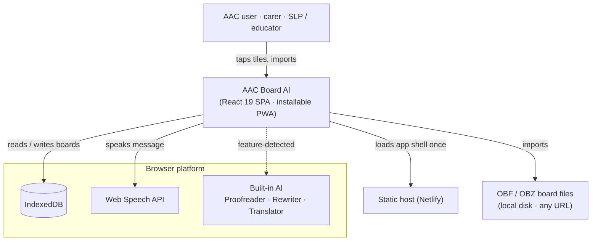
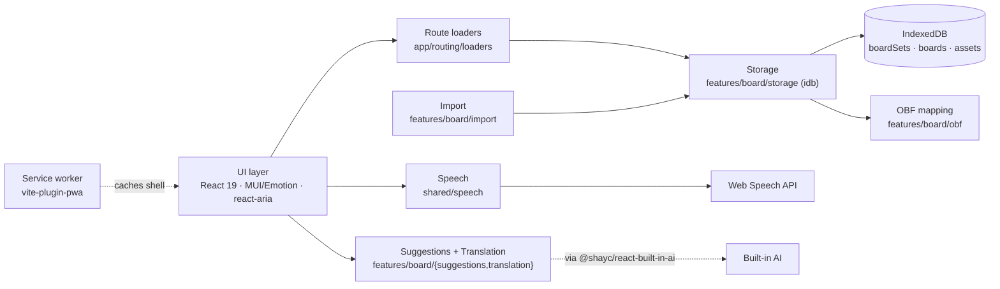

# Architecture

> **TL;DR** — AAC Board AI is a local-first, offline PWA for augmentative and
> alternative communication. Communication boards (Open Board Format) live in
> IndexedDB on the device. Tapping tiles builds a message that the Web Speech API
> reads aloud; on-device Built-in AI (Chrome/Edge) refines grammar, tone, and
> translation. **No backend, no telemetry.**
>
> New here? The whole board domain lives under `src/features/board/` — start with
> `board-viewer.tsx`.

**Scope:** the shape of the app and the rules behind it — modules, boundaries,
invariants, and load-bearing decisions.
**Not in scope:** setup and commands (see `README.md` and `AGENTS.md`), per-symbol
API docs (read the code), and code style (`AGENTS.md`).
**Audience:** contributors new to the codebase, and AI agents working in it.
Assumes React, TypeScript, and the Web Platform; no AAC background needed (see the
[glossary](#glossary)).

**Top quality goals, in order:**

1. **Accessibility** — this is an AAC tool for people who cannot rely on speech; it is _the_ goal, not _a_ goal.
2. **Offline reliability** — the core board must work with no network, ever.
3. **Privacy** — a vulnerable user population; nothing leaves the device.
4. **Responsiveness** — taps must feel instant.
5. **Internationalization** — any language, any text direction.

## Contents

- [Overview](#overview) — the problem
- [System context](#system-context) — neighbors and platform
- [Containers and runtime](#containers-and-runtime) — what runs, and the two core flows
- [Codemap](#codemap) — where the thing that does X lives
- [Data and state model](#data-and-state-model) — the five kinds of state
- [Invariants](#invariants) — rules you can't see by reading one file
- [Boundaries](#boundaries) — the seams, and where to swap things
- [Key decisions](#key-decisions) — the load-bearing choices and why
- [Verification](#verification) — how the claims are tested
- [Risks and technical debt](#risks-and-technical-debt) — the known fragilities
- [Glossary](#glossary) — AAC and domain terms

## Overview

The problem: give someone who cannot rely on speech a fast, reliable way to
communicate by tapping pictogram tiles, and read the result aloud — fully
offline, in any language and text direction.

Standard AAC boards force tile-by-tile selection that yields telegraphic output
("want eat pizza later"). This app's distinguishing move is to expand those short
inputs into natural sentences **on the device**, using the browser's Built-in AI —
so the help is private, instant, and works with no account or network.

Two hard constraints shape everything below:

- **Local-first.** The on-device IndexedDB is the source of truth. Everything works
  with no network. AI, translation, and URL import are _progressive enhancements_,
  never dependencies.
- **No backend.** The app is a static SPA deployed to a CDN (Netlify today). No server
  owns the data, so the load-bearing seams are all on the client.

## System context

The app is a browser SPA that leans entirely on Web Platform capabilities. Its only
"servers" are a static host and a board-file URL the user may choose to import from.

Built-in AI is drawn with a dashed line because it is **optional**: feature-detected
at runtime, absent on most browsers, and never required for core use.

## Containers and runtime

The app is one SPA; inside it, each capability sits behind its own module. A PWA
service worker (`vite-plugin-pwa`, `autoUpdate`) caches the shell so the app loads
offline after first visit, and the manifest registers `file_handlers` for
`.obf`/`.obz`, so the OS can hand board files straight to the app.

_Dashed edges are off the critical path: Built-in AI is feature-detected; the
service worker caches out of band._

**Runtime flow 1 — open a board (data before render).** React Router _loaders_ do
the work before any component renders, so nothing flashes untranslated or
half-loaded:

1. Navigate to `/sets/:setId/boards/:boardId`.
2. `boardSetLoader` — read and localize the board summaries used by the selector.
3. `hydrateBoard` — read the raw OBF and asset blobs, mint object URLs, and map
   `obfToBoard` into the in-memory `Board`.
4. `resolveTranslatedBoard` — serve the cached translation, or run the Translator
   and persist the result.
5. Render the selector and grid from the committed route snapshots.

**Runtime flow 2 — tap a tile (intent to speech).** A tap is resolved to a typed
_intent_, then dispatched. Most taps compose the message bar; some navigate or run
an action:

1. A tile tap (or Enter) goes through `resolveButtonIntents`, which yields typed
   intents: navigate, compose, speakText, playAudio, or runAction.
2. `activateButton` dispatches each intent — appending to the message bar,
   navigating to another board, or speaking / playing audio directly.
3. Playing the message runs `planPlayback` → Web Speech, with per-part
   highlighting as it speaks.

## Codemap

Coarse modules and what they do. Names are **symbol-searchable**, not
hyperlinked, so a moved file never breaks this table.

| Module                                                       | What it does                                                                                                                    |
| ------------------------------------------------------------ | ------------------------------------------------------------------------------------------------------------------------------- |
| `src/main.tsx`                                               | Entry. Mounts `AppProviders` → `AppRouter`.                                                                                     |
| `src/app/`                                                   | Composition root: router, route loaders, app shell, header, library/settings drawers, onboarding.                               |
| `src/app/routing/loaders/`                                   | React Router data loaders. Read selector summaries and **hydrate + translate a board before it renders**.                       |
| `src/pages/`                                                 | Route entry components, each code-split via React Router's `lazy` route import.                                                 |
| `src/features/board/`                                        | The entire board domain. `board-viewer.tsx` is the orchestrator.                                                                |
| `src/features/board/grid·tile·pictogram/`                    | Render the tile grid and each pictogram.                                                                                        |
| `src/features/board/activation/`                             | Tap → typed intent → dispatch. Search `resolveButtonIntents`, `createButtonActivation`.                                         |
| `src/features/board/message/`                                | The message bar: accumulate parts, then `planPlayback` → TTS with per-part highlighting.                                        |
| `src/features/board/navigation/`                             | Board-to-board navigation over the router. Search `useBoardNavigation`, `boardPath`.                                            |
| `src/features/board/keyboard/` + `grid/use-grid-keyboard.ts` | Keyboard as a first-class input surface: grid navigation (`useGridKeyboard`) and message editing (`useBoardKeyboard`).          |
| `src/features/board/obf/`                                    | **OBF → in-memory `Board`** mapping and action parsing. The format _read_ seam. Search `obfToBoard`, `parseAction`.             |
| `src/features/board/import/`                                 | File / drag-drop / URL / file-handler import → parse → write IndexedDB. The format _write_ seam. Search `importBoardSets`.      |
| `src/features/board/storage/`                                | **The only reader/writer of IndexedDB.** `boards-db.ts` (idb) + `board-hydration.ts` (blobs → object URLs).                     |
| `src/features/board/board-sets/`                             | Board-set catalog (an external store with cross-tab sync) + delete/info dialogs.                                                |
| `src/features/board/suggestions/`                            | AI grammar + tone suggestions (Proofreader + Rewriter). Search `useSuggestions`.                                                |
| `src/features/board/translation/`                            | Board translation (Translator), cached in the board's IndexedDB strings. Search `resolveTranslatedBoard`.                       |
| `src/shared/speech/`                                         | Web Speech API TTS wrapper, voice catalog store, voice↔language sync.                                                           |
| `src/shared/language/`                                       | The one language model: UI/board/TTS language context + persisted store.                                                        |
| `src/shared/theme/`                                          | MUI/Emotion theme, light/dark, RTL, theme-color meta.                                                                           |
| `src/shared/built-in-ai/`                                    | App policy atop `@shayc/react-built-in-ai`: silent engine warm-up, shared rewriter context, per-engine language options.        |
| everything else under `src/shared/`                          | Small cross-cutting helpers (audio, snackbar, providers, shared components/hooks/utils); each directory name says what it does. |
| `src/shared/utils/{external-store,persisted-store}.ts`       | The two state primitives every cross-cutting store is built from.                                                               |
| `messages/*.json` + `project.inlang/`                        | Paraglide message sources (one JSON per locale), compiled to the generated `src/paraglide/`.                                    |

Two libraries the author maintains carry the heaviest seams: **`@shayc/open-board-format`**
(OBF/OBZ parsing) and **`@shayc/react-built-in-ai`** (React hooks over Chrome's
Built-in AI). The app never reaches past them.

## Data and state model

State has **five kinds**, each with one home:

1. **Source of truth — IndexedDB.** Three object stores: `boardSets` (metadata),
   `boards` (one raw `OBFBoard` per board), `assets` (image/sound blobs by path).
   Everything visible is derived from here. Only `src/features/board/storage/` touches it.
   Writes are batched and reads are bulk, so imports and board loads stay fast.
   The schema is versioned: `boards-db.ts` opens the database through `idb`'s
   `upgrade` callback, so a schema change ships as a new `DB_VERSION` plus a
   migration step there — nowhere else. Multi-tab upgrades are handled: a tab
   holding the old version closes its connection when a newer one needs to upgrade.
2. **Route state — React Router loaders.** Board summaries and the current board are
   fetched and localized before render; components receive ready route snapshots,
   never loading spinners of their own. A language change calls `revalidate()` to
   refresh both the selector and board.
3. **Reactive cross-cutting stores** — built on `createExternalStore` +
   `useSyncExternalStore`: the **board-set catalog** and the **TTS voice catalog**.
   These change outside React (DB writes, the browser's `voiceschanged` event).
4. **Persisted settings** — `createPersistedStore` (localStorage, written on every
   change): selected **language**, speech config (voice/rate/pitch/volume),
   playback config, switch-scanning access method and timing, AI shared context,
   and the onboarding-seen flag (`use-onboarding.ts`, key `hasSeenOnboarding`).
   Theme mode persists separately as MUI's `mui-mode`, read pre-paint in
   `index.html`.
5. **Local component state** — the in-progress message (`useMessage`), playback
   progress, grid focus. Never promoted to a global store.

**Cross-tab coherence** rides on `BroadcastChannel` (`board-sets-sync`) — one
listener per tab, registered at module load and never tied to a component mount, so
a second tab or window sees board-set changes without polling.

React **Context** carries only the three things that are genuinely app-wide:
language, theme, and the snackbar.

## Invariants

Rules that constrain every file but are visible in none — several are _absences_:

- **No backend, no telemetry, no tracking.** Nothing the user types or imports
  leaves the device. This is a safety property, not a preference.
- **The app is fully usable offline.** AI, translation, and URL import are
  feature-detected extras; core board use never depends on them.
- **Components never touch IndexedDB directly** — all persistence goes through
  `src/features/board/storage/`.
- **IndexedDB stores raw OBF, amended only by translation.** The one path that
  modifies a board's content outside import is `updateBoardStrings`, which
  appends a locale's entries to `obf.strings` after a translation resolves. The
  in-memory `Board` is still _derived on read_ via `obfToBoard`, so the mapping
  can evolve and any board can be re-derived losslessly.
- **The active hydrated board reaches components through route loaders.** Its data
  and translation are ready before render. Ancillary board summaries may be loaded
  by feature hooks through the storage API.
- **Built-in AI is reached only through `@shayc/react-built-in-ai`.** Support is
  detected by probing for the task-specific global — `isSupported(name)` is just
  `globalThis[name] != null` for `Proofreader`, `Rewriter`, `Translator` — never a
  User-Agent check. Every consumer **degrades gracefully**: suggestions vanish;
  translation falls back to the untranslated board (pictograms still carry meaning).
  No component assumes the AI API exists.
- **One language drives everything** — UI text (Paraglide), board content
  (translation), text direction (RTL), and TTS voice. The _available_ languages are
  the union of translated UI locales and installed TTS voices. Choosing a language
  never depends on the optional Translator API; unsupported board translation falls
  back independently.
- **No bespoke unlabeled controls.** Interactive elements are built on MUI primitives
  (with react-aria for low-level keyboard and press behavior); accessibility is
  asserted with **axe-core inside the browser test suite**, which CI runs.
- **No hardcoded user-facing strings** — all UI text flows through Paraglide `m`;
  layout is direction-agnostic (dual Emotion caches + stylis-rtl, logical CSS).
- **No hand-written `useMemo`/`useCallback`** — the React Compiler handles
  memoization; manual hooks are a rare escape hatch, not the default.
- **Theme values have a single source** (`theme-colors.ts`), shared into `index.html`
  by a Vite plugin; light/dark is a class toggled _pre-paint_ to avoid a flash.
- **Board media object URLs have a single owner** — a module-level registry in
  `board-hydration.ts` (a global because data-mode loaders have no unmount to hook
  into). A visible board's URLs are never revoked out from under it: a load
  superseded by rapid navigation revokes its own URLs, never the live ones. Only
  `boardLoader` may touch the registry; the abort/race choreography is documented
  where it lives, in `board-hydration.ts`.

## Boundaries

Each is the one place to change a concern:

- **Storage boundary — `src/features/board/storage/`.** Swap the database here and
  nowhere else.
- **OBF format boundary (read) — `src/features/board/obf/`.** This is the contract
  with the AAC ecosystem (OBF/OBZ). Changing the mapping is a breaking change to
  import compatibility.
- **Import boundary (write) — `src/features/board/import/`.** The only place a file
  becomes database records. All four entry points (picker, drag-drop, `?board=` URL,
  PWA file handler) converge on `importBoardSets`.
- **AI provider boundary — `@shayc/react-built-in-ai`.** App code only consumes its
  hooks; swap models or providers in the library, not in features.
- **Speech boundary — `src/shared/speech/`.** The only wrapper over the Web Speech
  API. Playback is single-flight: a new clip stops the current, and a clip merely cut
  short resolves rather than throwing.
- **Switch-access boundary — `src/shared/switch-scanning/`.** Persists the selected
  access method, timing, and assigned keyboard or mouse inputs, then translates that
  profile into the switch-scanning package's method and logical switches. The action
  bar and grid rows register as scan groups for action–control and row–tile traversal;
  board controls keep their native click handlers and receive only scan registration
  props.
- **i18n boundary — Paraglide `m` + `src/shared/language/`.** The only source of UI
  strings and the active locale.
- **Routing / data boundary — `src/app/routing/loaders/` + React Router.** The only path
  from storage into the render tree.

## Key decisions

The load-bearing choices and _why_. No separate ADR log; these summaries are the
record. Revisit one only if its rationale stops holding.

- **Local-first, no backend.** A vulnerable user population needs privacy by default
  and a board that works on a school network with no data agreement, subscription, or
  internet. Trade-off: no server-side sync; cross-device sharing means re-importing
  OBF/OBZ files (the app has no export yet — see Risks).
- **On-device Built-in AI over server AI.** Buys privacy, zero latency, zero cost, and
  offline operation — at the price of narrow browser support, which the
  progressive-enhancement invariant absorbs.
- **Open Board Format as the interchange model.** Interop with the existing AAC
  ecosystem matters more than a bespoke format. The cost is carrying a mapping layer.
- **Store raw OBF, derive `Board` on read.** Keeps imports lossless and lets the
  in-memory shape evolve without a data migration.
- **Translate and hydrate in route loaders.** Eliminates flash-of-untranslated
  content and keeps async data orchestration out of components.
- **Accessible primitives + real-Chromium browser tests.** Accessibility correctness is the
  product; it's verified against a real engine (Playwright via Vitest), with axe-core.

## Verification

Every test runs in **real Chromium** — Vitest browser mode with the Playwright
provider, configured in `vite.config.ts`; there is no jsdom tier. That is what makes
the accessibility claims testable rather than aspirational: component tests assert
with **axe-core**, and keyboard behavior is exercised against the actual engine.
Shared test setup lives in `src/shared/testing/`; board-domain helpers in
`src/features/board/test-utils.tsx`. Coverage thresholds in `vite.config.ts` are a
ratchet — set just under the measured baseline, raised alongside meaningful gains,
never lowered.

## Risks and technical debt

The known fragilities:

- **Built-in AI is Chrome/Edge-only.** The headline help — sentence expansion, tone,
  translation — is absent on most browsers today. Progressive enhancement absorbs it,
  but the differentiator reaches few users until support spreads.
- **No cross-device sync, and no export yet.** A board lives on one device; sharing
  means re-importing the original OBF/OBZ file elsewhere. The app cannot export, so
  in-app changes (like cached translations) cannot leave the device — export is the
  missing half of the "share via files" answer. No-sync is by design, but users
  will ask for it.
- **Speech support varies by language and device.** The language list combines every
  translated UI locale with languages exposed by installed TTS voices. Sparse voice
  coverage does not hide translated UI languages, but it can leave some languages
  without a matching speech voice.
- **Deploy config is host-specific.** Static hosting is portable, but the current
  config is Netlify-only (`netlify.toml`).

## Glossary

- **AAC** — Augmentative and Alternative Communication: tools for people who can't
  rely on speech.
- **OBF / OBZ** — Open Board Format: a single board (`.obf`, JSON) or a zipped board
  set with assets (`.obz`). The app's import contract (no export yet).
- **Board set** — a collection of linked boards with a root board, imported as a unit.
- **Tile / pictogram** — one grid cell: an image plus a label that the user taps.
- **Vocalization** — what a button _speaks_, when it differs from its visible label.
- **Message bar** — the strip of selected tiles accumulated into the sentence to speak.
- **Built-in AI** — Chrome/Edge on-device models exposed as the Proofreader, Rewriter,
  and Translator APIs (here: grammar correction, tone adjustment, translation).
- **TTS** — text-to-speech, via the browser's Web Speech API.

---

_Owner: @shayc · This is a slow-moving map by design — revisit ~2×/year, not per-commit._
