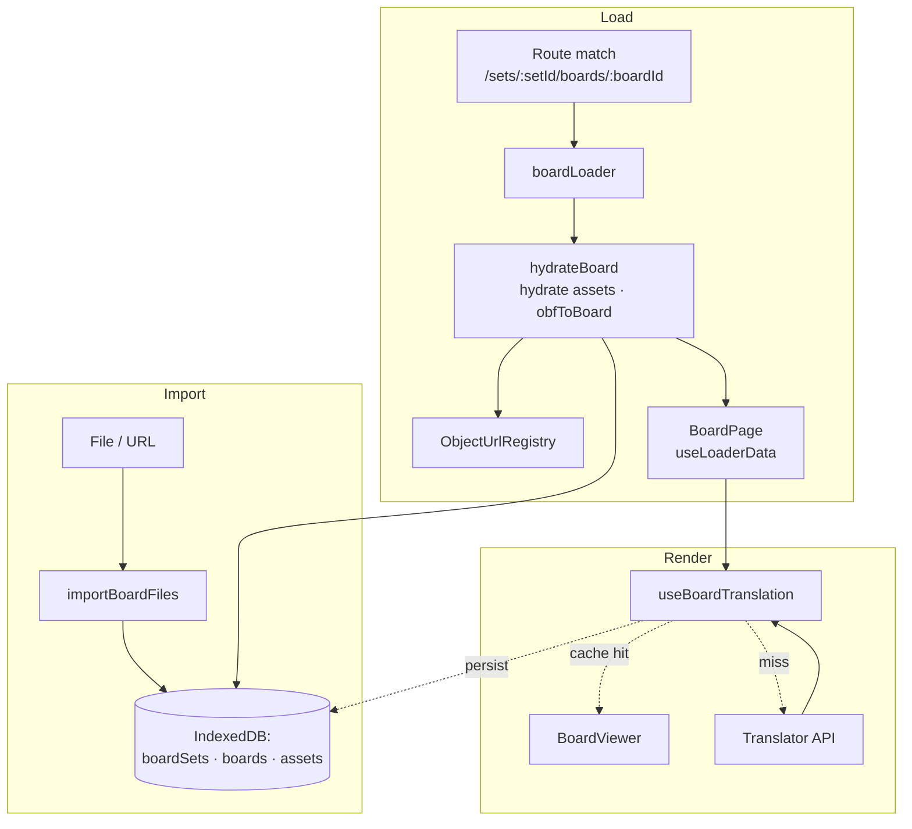

# Architecture

> **Audience:** contributors and coding agents making non-trivial changes to this repo. For a project introduction, see the [README](../README.md).

## 1. Overview

A client-side React 19 app for AAC (Augmentative and Alternative Communication): users who cannot rely on speech tap symbol tiles to assemble phrases the device speaks aloud. It renders [Open Board Format](https://www.openboardformat.org) (OBF) communication boards from an in-browser IndexedDB store — imported `.obf` / `.obz` files are parsed and persisted; boards are loaded on demand, optionally translated through the browser's Built-in AI, and rendered as a keyboard-navigable tile grid that drives a message strip with text-to-speech playback. There is no backend — every byte stays on the device.

Built-in AI is a leaf-level enhancement, not the architecture: when available, it adds proofreading and rewriting suggestions to the message strip, and translation to board labels. Everything else works without it.

## 2. Module layout

The codebase is **feature-sliced**. The single feature today is `board`. Layers and import rules:

- `@app/*` — app shell, providers, routing, top-level dialogs/drawers.
- `@features/*` — self-contained feature modules. May import from `@shared/*`. Must **not** import from `@app/*` or from each other.
- `@pages/*` — route components. Compose features and shared UI.
- `@shared/*` — cross-cutting code (Built-in AI hooks, speech, language, snackbar, theme, utilities). No knowledge of features.
- `@paraglide/*` — generated UI translations (build artifact, never edited by hand).

Aliases are declared in [tsconfig.app.json](../tsconfig.app.json) and mirrored in [vite.config.ts](../vite.config.ts). These import rules are enforced by `no-restricted-imports` in [eslint.config.js](../eslint.config.js), not left to convention.

**Public-barrel rule.** UI layers consume the board feature through [`@features/board`](../src/features/board/index.ts); board-set dialogs, path helpers, and storage queries are all re-exported from the barrel so consumers never need a deeper import. Tests that need to seed or reset feature state use the sanctioned [`@features/board/testing`](../src/features/board/testing.ts) entry — the only other path `@app`/`@pages` may reach. Everything deeper (`storage/`, `obf/`, …) is internal.

**Tests.** Co-located as `*.test.ts` / `*.test.tsx` next to the file under test.

**See:** [tsconfig.app.json](../tsconfig.app.json), [src/features/board/index.ts](../src/features/board/index.ts).

## 3. App shell & routing

The app runs React Router in data mode: routes carry loaders, page modules export a `Component` for code-splitting, and the router itself owns the loading and error states.

| Path                           | Loader                | Component     | Notes                                                                   |
| ------------------------------ | --------------------- | ------------- | ----------------------------------------------------------------------- |
| `/`                            | `rootIndexLoader`     | —             | Redirects: honors `?board=<url>`, else picks an existing or seed board. |
| `/sets/:setId`                 | `boardSetIndexLoader` | —             | Redirects to the set's root board.                                      |
| `/sets/:setId/boards/:boardId` | `boardLoader`         | `BoardPage`   | Returns a hydrated `Board`; consumed via `useLoaderData`.               |
| `/library`                     | —                     | `LibraryPage` | Browse, import, delete board sets.                                      |
| `/about`                       | —                     | `AboutPage`   | Static content.                                                         |

`HydrateFallback={LoadingState}` lives on the root route. A `RouteErrorBoundary` is nested _inside_ `<AppShell>` so the header, drawers, and menu stay mounted when a page throws — a 404 or import failure replaces only the `<Outlet>`.

**App shell.** `<AppShell>` is the layout shared by every route: header, menu drawer, settings drawer, onboarding dialog, and an `<Outlet>` for the active page. Onboarding shows on first visit, gated by the `hasSeenOnboarding` localStorage key through `useOnboarding`. The settings drawer composes four panels from [src/app/settings/](../src/app/settings/) — `AppearanceSettings`, `LanguageSettings`, `SpeechSettings`, `AISettings`. Add a setting by adding a panel.

**Page title.** Each page declares its title with `<PageTitle>{name}</PageTitle>`; `AppHeader` reads it via `usePageTitle()` from a module-level external store. Decoupling the chrome from page identity means the header doesn't have to know which route is mounted, and pages that want no title simply don't render the component.

**Provider stack.** `AppProviders` composes context outer-to-inner:

```
LanguageProvider              // selected language + Paraglide locale
└─ ThemeProvider              // MUI theme, swapped LTR/RTL via useLanguage().direction
   └─ SnackbarProvider        // queued transient feedback
```

Order is load-bearing: `ThemeProvider` reads `direction` from `useLanguage()` to pick the LTR or RTL emotion cache and theme. Speech is not a provider — it lives in a module-level store (§6). `LanguageProvider` keeps that store in sync via `useVoiceLanguageSync`, which auto-selects a default voice for the active language whenever the current voice doesn't match. It also synchronizes Paraglide's runtime locale during render so the first paint after a language change is already translated.

**See:** [src/app/app-router.tsx](../src/app/app-router.tsx), [src/app/loaders/](../src/app/loaders/), [src/app/layouts/app-shell.tsx](../src/app/layouts/app-shell.tsx), [src/app/app-providers.tsx](../src/app/app-providers.tsx), [src/shared/language/language-provider.tsx](../src/shared/language/language-provider.tsx).

## 4. Loading a board

The end-to-end pipeline from imported file to rendered board:



**Registry lifecycle.** `hydrateBoard` is the sole owner of asset blob URLs. Each call creates its own `ObjectUrlRegistry` and receives the loader's `request.signal`; if the route is superseded mid-flight (rapid navigation) the registry self-destructs rather than promoting, so the live load's URLs aren't orphaned. On success it promotes itself to a module-level `previousRegistry` and revokes the prior one. The boundary lives in the loader, not React, because under data mode there is no component unmount to hook into — the next load is what defines "safe to release."

**Anti-flash translation.** `useBoardTranslation` initializes state with a _synchronous_ lookup against `board.strings[language]`, so cached translations land on first paint. On a miss, an effect creates a `Translator`, translates labels and vocalizations in parallel against a shared `AbortController`, persists the result back via `updateBoardStrings`, and applies a derived `Board`. If the Translator is unavailable or rejects, the hook keeps the current board — AAC UX requirement: never flash the source language. The cache write means subsequent loads in any tab hit the cache instead of the model.

**Cross-tab invalidation.** Imports and deletes update IndexedDB, refresh the local `board-sets-store` snapshot, and post to a `BroadcastChannel("board-sets-sync")`; other tabs receive the message and refresh their own snapshots. The channel and its listener live at module scope in `board-sets-store.ts` — one per tab, registered at import time, never tied to a component mount.

**See:** [src/features/board/import/board-import.ts](../src/features/board/import/board-import.ts), [src/features/board/storage/queries.ts](../src/features/board/storage/queries.ts), [src/features/board/storage/board-sets-store.ts](../src/features/board/storage/board-sets-store.ts), [src/features/board/translation/use-board-translation.ts](../src/features/board/translation/use-board-translation.ts), [src/app/loaders/board-loader.ts](../src/app/loaders/board-loader.ts).

## 5. State & persistence

Three layers, by lifetime.

### IndexedDB

Database `aac-boards-db`, version 1.

| Object store | Key                | Indexes                        | Holds                                       |
| ------------ | ------------------ | ------------------------------ | ------------------------------------------- |
| `boardSets`  | `setId`            | `byUpdatedAt`                  | `BoardSetRecord` — metadata per import.     |
| `boards`     | `[setId, boardId]` | `bySetId`                      | `BoardRecord` — the OBF JSON for one board. |
| `assets`     | `[setId, path]`    | `bySetId`, `bySetIdAndMediaId` | `AssetRecord` — image/sound `Blob`s.        |

Access goes through helpers in `db.ts`. `withBoardsDB(op)` opens the DB, runs the callback, and closes — connections are not pooled because the working set is small and per-operation latency is dominated by the work itself. Deletes use a bound `IDBKeyRange` to remove all rows for a `setId` in a single transaction.

### localStorage

| Key                 | Holds                                   | Owner                                                              |
| ------------------- | --------------------------------------- | ------------------------------------------------------------------ |
| `language`          | Selected primary language subtag.       | [LanguageProvider](../src/shared/language/language-provider.tsx)   |
| `speech-config`     | Selected voice + rate / pitch / volume. | [speech-store](../src/shared/speech/speech-store.ts)               |
| `ai-shared-context` | User-supplied custom prompt for AI.     | [useAISharedContext](../src/shared/hooks/use-ai-shared-context.ts) |
| `hasSeenOnboarding` | Boolean — has the welcome dialog shown. | [useOnboarding](../src/app/onboarding/use-onboarding.ts)           |

Most keys flow through `usePersistentState`. `speech-config` is the exception: `speech-store` owns it directly and subscribes itself to persist on every change, because the store also drives an external-store API consumed via `useSyncExternalStore` (§6).

### Runtime stores

| Context           | Provides                                               |
| ----------------- | ------------------------------------------------------ |
| `ThemeContext`    | MUI theme; consumed via `sx` callbacks.                |
| `LanguageContext` | Available languages, selected language, `setLanguage`. |
| `SnackbarContext` | `showSnackbar` + queued `<Snackbar>` UI.               |

| External store     | Provides                                                               |
| ------------------ | ---------------------------------------------------------------------- |
| `board-sets-store` | Board-set list + cross-tab sync (§4).                                  |
| `speech-store`     | Voice catalog (driven by `voiceschanged`) + speech config (§6).        |
| `page-title-store` | Current page title; written by `<PageTitle>`, read by `AppHeader`.     |
| `progress-store`   | In-flight Built-in AI download progress, keyed by name + options (§7). |

External stores are preferred over context where state outlives any single component, is driven by browser events outside React, or needs cross-tab visibility. Components subscribe through `useSyncExternalStore`.

**See:** [src/features/board/storage/db.ts](../src/features/board/storage/db.ts), [src/shared/utils/external-store.ts](../src/shared/utils/external-store.ts), [src/shared/hooks/use-persistent-state.ts](../src/shared/hooks/use-persistent-state.ts).

## 6. Interaction & speech

A board press flows through `resolveButtonIntent` (called by `createButtonActivation`), which evaluates the button into an array of `ButtonIntent` objects. It then loops through the intents and executes their side-effects:

| Intent Type | Execution Effect                                         |
| ----------- | -------------------------------------------------------- |
| `navigate`  | `useBoardNavigation.goToBoard(targetBoardId)`.           |
| `runAction` | Run the corresponding `BoardAction` (table below).       |
| `compose`   | Append a `MessagePart` to the message strip.             |
| `playAudio` | Play the button's sound asset via `playAudio()`.         |
| `speakText` | Read the button's vocalization/label via `speech-store`. |

`BoardAction` is a closed discriminated union dispatched by `kind` in `runAction`:

| `kind`      | Effect                                             |
| ----------- | -------------------------------------------------- |
| `space`     | Append an empty `MessagePart`.                     |
| `backspace` | Remove the last `MessagePart`.                     |
| `clear`     | Empty the message.                                 |
| `home`      | `useBoardNavigation.goHome()`.                     |
| `speak`     | Play the current message via `useMessagePlayback`. |
| `spell`     | Append `action.text` to the last part's label.     |

OBF's raw `:space` / `+<text>` notation is parsed into `BoardAction` at the OBF boundary ([obf-to-board.ts](../src/features/board/obf/obf-to-board.ts)); downstream code never sees the source strings.

`useBoardNavigation` carries a `backStack: string[]` on `location.state` so `Back` returns to the previously-visited board in the set rather than the prior browser-history entry.

Adding a new button behavior means extending `ButtonIntent` (or `BoardAction`) and handling it in `createButtonActivation`'s execution loop — the dispatch surface is closed.

**Message composition.** `useMessage` owns the draft as `MessagePart[]` in component state — ephemeral by design: it survives in-board navigation (same route, no remount) but resets on reload, because a half-composed utterance is current speech, not a saved document. The derived `text` (`parts.map(p => p.label).join(" ")`) is what `useSuggestions` consumes.

**Playback.** Two engines, interleaved by `useMessagePlayback`:

- **Speech** — `speech-store` is a module-level store with an imperative API: `speak(text, { signal })` — aborting the signal cancels in-flight speech — plus `setVoiceURI` / `setRate` / `setPitch` / `setVolume`. Internally it holds a voice catalog refreshed on `voiceschanged` and a config persisted to `speech-config`. `useVoiceLanguageSync` (called from `LanguageProvider`) watches the catalog and the active language and auto-selects a fallback voice whenever the current `voiceURI` doesn't match an installed voice for that language. Read-only hooks `useVoicesByLanguage` and `useSpeechConfig` back the settings UI.
- **Audio** — `playAudio(url, { signal })` is a module-level controller mirroring `speak()`: one `<audio>` element app-wide, single-flight (a new clip stops the current). It resolves on `ended` or when superseded/aborted, and rejects only on a genuine media error — so a clip cut short never surfaces as an unhandled rejection.

`useMessagePlayback` walks each `MessagePart` in order: if it has a `soundSrc`, play the audio; otherwise speak `getSpokenText(part)` (vocalization, falling back to label). Adjacent text parts are merged into one utterance to avoid clipped speech between words.

**See:** [src/features/board/activation/button-activation.ts](../src/features/board/activation/button-activation.ts), [src/features/board/activation/intent-resolver.ts](../src/features/board/activation/intent-resolver.ts), [src/features/board/navigation/use-board-navigation.ts](../src/features/board/navigation/use-board-navigation.ts), [src/features/board/message/use-message.ts](../src/features/board/message/use-message.ts), [src/features/board/message/use-message-playback.ts](../src/features/board/message/use-message-playback.ts), [src/shared/speech/speech-store.ts](../src/shared/speech/speech-store.ts), [src/shared/audio/play-audio.ts](../src/shared/audio/play-audio.ts).

## 7. Built-in AI

The app adapts to the browser's capabilities, not its version. There is no hard-coded minimum version.

- **Always works:** board rendering, navigation, message composition, text-to-speech, board import, offline use.
- **Enhanced when available** — each capability is detected at module load (`"X" in self`); UI components condition on the matching boolean and the affordance is hidden when missing, never broken:
  - **Translator** — translates board labels into the user's language and caches the result (§4, §8).
  - **Rewriter** — tone-adjusted phrase suggestions in `SuggestionBar`.
  - **Proofreader** — grammar/spelling correction suggestions in `SuggestionBar`.

For instructions to enable Built-in AI in supported browsers, see [Enabling Built-in AI](../README.md#enabling-built-in-ai).

**Model storage is not ours.** Built-in AI models are downloaded and managed by the browser's on-device infrastructure, not by the PWA service worker (§9). A first-time model download requires network; once cached by the browser, the capability is offline too — but installing the PWA does not pre-warm it.

**Capability detection.** `isSupported(name)` returns whether the matching global (`"Translator"`, `"Rewriter"`, `"Proofreader"`) is present on `self`. `AISettings` and `LanguageSettings` call it directly to gate AI affordances at render time. Hook consumers (e.g. `useSuggestions`) usually skip the standalone check and read `status` instead — `"unsupported"` covers the missing-global case, and the other terminals (`"unavailable"`, `"error"`) cover the rest of the readiness picture.

**Lifecycle state machine.** Each hook owns a per-call-site store that walks `idle → downloading → ready`, with terminal `unsupported` / `unavailable` / `error`. If the model is already local, the store auto-provisions silently (no `downloading` flash); if a download is required, `status` stays `idle` until a user gesture starts it. Option changes tear down the instance, abort in-flight work, and re-enter the machine. Imperative `create*` factories share the same internal path, so a download started outside the React tree still surfaces through the same progress channel. **Full API surface, error model, and examples:** [`@shayc/react-built-in-ai`](https://github.com/shayc/react-built-in-ai#readme).

**Cross-instance progress.** Each download writes its `event.loaded` to a module-level `progress-store` keyed by `name + options`. `useGlobalDownloadProgress(namespace?)` reads the highest in-flight value via `useSyncExternalStore`, aggregating downloads from every hook and creator. `LanguageSettings` consumes the `"Translator"` slice to render its progress alert.

**Where `sharedContext` is used.** The persisted `ai-shared-context` string flows only through `useSuggestions` into `useRewriter({ sharedContext })`. The translator and proofreader hooks do not consume it.

**Suggestions composition.** `useSuggestions` runs the proofreader and rewriter in parallel against a shared `AbortController`, cancels in-flight calls when the input changes, dedupes results, and filters out low-quality outputs (entries with underscored tokens or stray quote marks).

**See:** [@shayc/react-built-in-ai](https://github.com/shayc/react-built-in-ai#readme), [src/features/board/suggestions/use-suggestions.ts](../src/features/board/suggestions/use-suggestions.ts).

## 8. Internationalization

Two layers, different mechanisms by design: the strings the app owns are pre-translated at build, while user-imported content is translated on demand at runtime.

**UI translation (Paraglide).** UI strings live in [`messages/<locale>.json`](../messages/) and are compiled to [`src/paraglide/`](../src/paraglide/) at install/build by the inlang Paraglide plugin (configured in [vite.config.ts](../vite.config.ts) and [project.inlang/settings.json](../project.inlang/settings.json)). Components import `m` from `@paraglide/messages.js` and call `m.foo()` — no runtime fetching, no async loading. `LanguageProvider` syncs the runtime locale during render with `setLocale(..., { reload: false })`, so the first paint after a language change is already translated. Base locale is `en`; Hebrew (`he`) is the second fully-localized locale and drives right-to-left layout via `getTextDirection`. Other locales fall back to the base. Sentences with inline links use `<ParaglideMessage>` from `@inlang/paraglide-js-react` with `{#tag}…{/tag}` placeholders in the message string, so translators can reorder clauses around the links — see [about-page.tsx](../src/pages/about-page.tsx).

**Board translation (Translator API).** When the user's selected language differs from a board's locale, `useBoardTranslation` resolves a translated `Board` (§4). OBF (`board.locale`) and the Web Speech API (`voice.lang`) both use [BCP-47](https://www.rfc-editor.org/info/bcp47) tags; the app splits them into a `locale` (full tag, e.g. `"en-US"`) and a `language` (primary subtag, e.g. `"en"`). The language picker is derived from installed TTS voices intersected with Translator-supported languages — no point offering a language the user can neither hear nor see translated.

**Locale helpers.** In [src/shared/utils/locale.ts](../src/shared/utils/locale.ts): `normalizeLocale` (canonical casing), `getLanguageCode` (locale → primary subtag), `getTextDirection`, `getEnglishLocaleName`, `getNativeLanguageName`.

**See:** [src/shared/language/language-provider.tsx](../src/shared/language/language-provider.tsx), [src/features/board/translation/use-board-translation.ts](../src/features/board/translation/use-board-translation.ts), [src/shared/utils/locale.ts](../src/shared/utils/locale.ts).

## 9. PWA & offline

Powered by `vite-plugin-pwa`:

- **Installable** on desktop and mobile.
- **Auto-updating** service worker (`registerType: "autoUpdate"`) — the latest build loads without user action.
- **Offline-capable** — after the first visit, all app assets are served from the service worker cache. Imported board sets and assets are already in IndexedDB, so the app remains fully functional without a network.

The SW cache covers app shell and assets only; Built-in AI models live in the browser's separate on-device store (§7) and need a one-time network connection to download before they become offline-capable.

Configuration lives in [vite.config.ts](../vite.config.ts) under the `VitePWA()` plugin.
