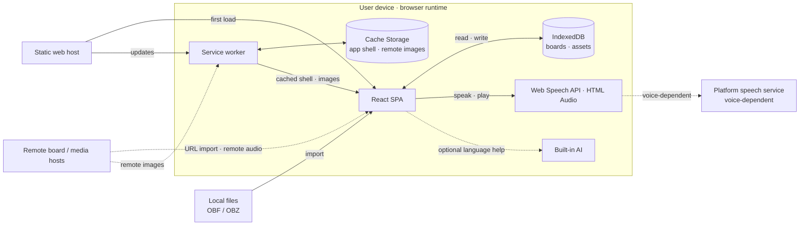

# Architecture

AAC Board AI is a device-local progressive web app (PWA) for people who cannot
rely on speech. Users select tiles to compose messages that the browser can
speak. The app uses React, TypeScript, Vite, MUI, and React Router. Built-in AI
provides optional, on-device language help.

Accessibility comes first, followed by offline reliability, privacy,
responsiveness, and internationalization. People rely on the app to communicate,
so optional features must never be required to read, navigate, or compose with a
loaded board.

See [README.md](../README.md) for product details and setup,
[AGENTS.md](../AGENTS.md) for contribution and testing rules, and the
[glossary](#glossary) for AAC terms.

- [Runtime architecture](#runtime-architecture)
- [Data and state ownership](#data-and-state-ownership)
- [Core flows](#core-flows)
- [Accessibility, language, and presentation](#accessibility-language-and-presentation)
- [Module boundaries and code map](#module-boundaries-and-code-map)
- [Current limitations](#current-limitations)
- [Glossary](#glossary)

## Runtime architecture

The app is a single-page application (SPA) with no application backend, telemetry,
or tracking. Keeping boards on-device protects communication content and supports
use on restricted networks; the trade-off is no built-in cross-device sync.

A static host serves the app and updates. The service worker caches the app shell
after the first successful load and third-party images as they are displayed.
Once the shell and board are available locally, core communication works offline.
Playback depends on locally available media and speech voices. Storing a board
set asks the browser for persistent storage, so boards are not evicted when the
device runs low on space; browsers may prompt or decline, and the app works
either way.

```mermaid
flowchart LR
    accTitle: AAC Board AI runtime and trust boundaries
    accDescr: The device-local React app stores boards in the browser, uses browser output and optional built-in AI, and contacts network hosts for loading, updates, URL imports, remote media, or a voice-dependent speech service.

    files["Local files<br/>OBF / OBZ"]
    host["Static web host"]
    remote["Remote board / media hosts"]
    voice["Platform speech service<br/>voice-dependent"]

    subgraph browser["User device · browser runtime"]
        SPA["React SPA"]
        SW["Service worker"]
        IDB[("IndexedDB<br/>boards · assets")]
        CACHE[("Cache Storage<br/>app shell · remote images")]
        OUT["Web Speech API · HTML Audio"]
        AI["Built-in AI"]

        SPA <-->|read · write| IDB
        SW <--> CACHE
        SW -->|cached shell · images| SPA
        SPA -->|speak · play| OUT
        SPA -.->|optional language help| AI
    end

    files -->|import| SPA
    host -->|first load| SPA
    host -->|updates| SW
    remote -.->|URL import · remote audio| SPA
    remote -.->|remote images| SW
    OUT -.->|voice-dependent| voice
```

Dashed edges mark optional or platform-dependent integrations.

Built-in AI runs on-device without per-request network access once a model is
available. The app checks for AI capabilities directly rather than inferring
support from User-Agent strings.

## Data and state ownership

State has distinct owners and lifetimes:

| State                 | Owner                                 | Contents                                                                                               |
| --------------------- | ------------------------------------- | ------------------------------------------------------------------------------------------------------ |
| Durable board data    | IndexedDB through board storage       | Board-set metadata, source OBF records, and asset blobs                                                |
| Active board          | React Router loaders                  | Stored `Board`, and its set's board list and root board, for the current route                         |
| Asset URLs            | Board storage                         | One object URL per loaded asset, kept until board set deletion or page close                           |
| Navigation history    | React Router                          | Browser history with a flag allowing board Back navigation                                             |
| Reactive shared state | `createExternalStore`                 | Board-set library, board-set downloads, board translation status, voice catalog, and playback progress |
| Persisted preferences | `createPersistedStore` + localStorage | Language, speech, tile and message display, switch scanning, suggestion instructions, onboarding       |
| Interaction state     | Local React state                     | In-progress message parts and remembered grid focus                                                    |

Stored boards retain their OBF structure for AAC compatibility, preserving
imported fields while adding translations saved on this device. Board links
carry the linked board's ID, which the OBF library resolves from the archive.
Board-set records store the set's translated names. `obfToBoard` derives the
runtime `Board` on each read, so runtime types can evolve without rewriting
stored records. The storage schema in
[`boards-db.ts`](../src/features/library/storage/boards-db.ts) has no migrations
yet: a schema change edits it in place, and a browser holding an older database
needs its site data cleared.

React Context provides theme, playback controls, and snackbar access.
Components subscribe to external stores through `useExternalStore`, a
`useSyncExternalStore` wrapper that takes an optional selector.

Playback uses slice subscriptions: each component tracks only the progress fields
it needs. Word-boundary updates rerender only components whose selected fields
change.

Device output does not read settings stores. `AppProviders` gives the playback
coordinator a `getSpeechParameters` function, and the coordinator calls it for
each speech step, so every utterance uses the language, voice, rate, pitch, and
volume current at that moment.

The board-set library broadcasts changes so other tabs can refresh their lists.
Preferences managed by `createPersistedStore` do not synchronize across tabs. MUI
persists and synchronizes theme mode separately.

Stores are module singletons that start working when first imported, so they
need no provider and their loading starts before React renders. The cost is that
a store outlives a test, so tests reset the state behind it. The shared [test
setup](../src/shared/testing/setup.ts) clears localStorage and calls
`reloadPersistedStores` before each test. Tests that touch stored boards call
`resetBoardsDB` from the library's
[`testing`](../src/features/library/testing/index.ts) entry, which empties
IndexedDB and refreshes the board-sets store.

## Core flows

### Start at `/`

At `/`, a board URL supplied through `?board=` takes precedence: the app names
the link's host and imports only after the user confirms, because `/` opens the
newest board set and a link alone must not change it. URL downloads reject
redirects to another host, so the named host is the one that serves the file.
Otherwise, the app opens the newest stored board set, or imports the bundled
starter board set if the library is empty.

### Import board files

File selection, drag and drop, URL imports, and PWA file handling all use
`importBoardFile`. Each imported file creates a separate board set. The three
local-file entry points go through `useImportBoardFiles().importFiles`, which
skips files without a board file extension and reports when none remain. It
imports the rest one at a time, so a failing file doesn't block the others, and
reports the outcome in one message that names the file when exactly one fails.

### Export a board set

Export is the reverse, for one set at a time from its library menu.
`boardSetToOBZ` packages the stored OBF records, which already carry the
translations saved on this device, with the set's stored assets:

- `createOBZ` points board links at the boards it packages.
- Media take the normalized path their file is stored under.
- Media whose file was never stored drop their path and fall back to `data` or
  `url`.

The set name, translated into the communication language, names the file.

### Open a board

Route loaders only read; they never translate or wait on a model:

1. Navigation to `/sets/:boardSetId/boards/:boardId` runs
   [`boardSetLoader`](../src/app/routing/loaders/board-set-loader.ts) for the
   header's board list and the set's root board, which Home navigates to
   (once per set, not per board), and
   [`boardLoader`](../src/app/routing/loaders/board-loader.ts), which calls
   `loadStoredBoard`. It reads the stored OBF, resolves object URLs for its
   stored assets, and maps both through `obfToBoard`. Loading leaves the OBF
   unchanged. Media paths resolve only to stored assets; otherwise the item's
   `data` or `url` is used. A link to a board the set does not store is left
   out of the loaded board, so its tile is an ordinary tile.
2. The page renders the board in the communication language through
   `useBoardInLanguage`: the source board, or the board's own translations for
   that language, from the board file or saved on this device. The hook also
   names the language the board ended up in, which is the board's own when it
   has no translation.

Stored assets are immutable, so
[each asset has one object URL](../src/features/library/storage/asset-urls.ts) for
as long as its board set exists. Message parts keep their media after leaving
the board they came from. A library refresh revokes the URLs of deleted board
sets.

### Translate board sets

[`useTranslateBoardSets`](../src/features/library/translation/use-translate-board-sets.ts)
runs in the app shell on start, on a language change, and when sets are added
or removed. Only a language change aborts the pass in progress; an added or
removed set queues another pass behind it, so a model download started by the
language change's user gesture is never cancelled. Each pass starts with the
set on screen, so that set never waits behind the rest.

For each set not yet in the communication language, it translates the set name
and every board missing that language, then saves them in one transaction.
Boards are checked one by one, because a set's language is only its root
board's. The set name comes from the root board's own translations when the
board file has them, so a set whose file ships every translation is named even
without the Translator API. A saved set name therefore marks the whole set as
translated, so later runs skip it without reading its boards. A set deleted
mid-translation is not written back.

After each saved set, it syncs the library and, when that set is on screen or
being navigated to, revalidates the routes (board and board list), so
everything on screen updates without a reload. Other sets are not revalidated:
that would re-run a `?board=` link import still in flight. A set the
translator fails on, for example because a model download needs a user
gesture, stays in its source language until the next run. A storage or other
error ends the pass and is reported, and passes queued behind it still run.

The hook hands each pass to the
[board translation coordinator](../src/features/library/translation/board-translation-coordinator.ts),
which owns the queue, the abort on a language change, and the board translation
status published while a pass is translating a set. The status is set when a
set's model download starts or, with no download, once its translation models
are open, and cleared when the pass ends or the language changes. A pass aborted
by a language change never touches the status again. The
[board translation notice](../src/features/library/translation/board-translation-notice.tsx)
shows a model download first and the translation after it. The status is already
set when the download ends, so one alert carries both states.

### Activate a tile

[`activateButton`](../src/features/board/activation/button-activator.ts)
coordinates message updates, navigation, and playback:

1. A tile linking to another board navigates immediately. A tile without actions
   appends a message part and plays it. Other tiles apply their actions in order.
   A spelling action (OBF `+a`) extends the word being spelled, starting a text
   part if there is none; a space action (OBF `:space`) or a new tile part closes
   the word. Backspace removes one character from the word being spelled,
   reopens a closed word without removing a character, and removes a tile part
   whole.
2. A play action (OBF `:speak`) captures the message at that point. Changes
   from later actions, such as clearing the message, apply only if playback
   finishes uninterrupted. The played message stays visible during playback and
   is preserved if playback is interrupted.
3. Once the whole message plays to its end, from the play button, the keyboard
   shortcut, or a tile that only plays it, the next tile or letter starts a new
   message. Editing the message, or replaying it without letting it finish,
   keeps adding to it. A tile that spells and then plays echoes the word and
   does not count. A message setting turns this off.
4. The board playback adapter calls `planPlayback` to turn message parts into
   speech and recorded-audio steps. The shared coordinator plays them in order
   and publishes progress for highlighting.

Each new playback request interrupts the current one. These interruptions are
expected and do not surface as user errors.

The shared coordinator resolves each request as completed, interrupted, or
failed. The board playback adapter is the only place that reads that outcome:
it reports a failure once in an error snackbar, including when only some steps
failed, and tells its callers only whether a message played to its end.

## Accessibility, language, and presentation

### Accessibility

Controls have programmatic names and support pointer, keyboard, and switch
input. The
[board grid](../src/features/board/grid/grid.tsx) and its
[keyboard behavior](../src/features/board/grid/use-grid-focus.ts) preserve
these rules:

- A populated grid has one Tab stop, at the remembered tile or first occupied
  cell.
- Arrow keys move between focusable cells; horizontal movement follows text
  direction.
- Home and End move to the first or last focusable cell in the row; with Ctrl
  or Cmd, in the grid.
- When grid content changes, focus returns to the remembered cell or first
  focusable tile only if no other control holds focus.

Behavior tests and axe-core accessibility checks run in real Chromium through
Playwright-backed Vitest.

### Switch scanning

People who cannot tap or use a keyboard select with one or two switches, which
arrive as the Space and Enter keys. Scanning is off until turned on in settings.
[`scanning/`](../src/features/board/scanning/) holds all of it:

- A scan group is any element spread with `scanGroupProps`; its items are the
  enabled buttons inside it. The message bar marks itself, and the board marks
  its controls and each grid row; the grid itself knows nothing about scanning
  and spreads the row props the board hands it. The
  [scanner](../src/features/board/scanning/switch-scanner.tsx) reads the groups
  from the DOM at every step, in document order, highlights the current group
  or item with an attribute, and clicks the selected one. The buttons being
  scanned therefore need no scanning code, and disabled controls and empty
  groups drop out by themselves.
- [`scan-sequence.ts`](../src/features/board/scanning/scan-sequence.ts) is the
  pure state machine: the scan moves through groups, selecting a group moves
  through its items, and selecting an item activates it. A group with one item
  activates it directly. After a group's last item the whole group is
  highlighted once more as an exit step; selecting it returns to the groups.
  Positions hold targets rather than indexes, so the board may change between
  steps.
- Automatic scanning moves on a timer and either switch selects. It starts on
  the first press, pauses after two passes over the groups, and moves on to the
  next group after two passes over a group's items. Two-switch step scanning
  moves with Space, selects with Enter, and keeps going around until a
  selection.
- Switch keys count wherever focus is, including on a header button, and are
  kept from the focused control. Keys typed into a text field are left alone,
  and so are keys pressed while a dialog, drawer, or menu covers the board.
  While scanning is on, Space and Enter therefore do not activate focused
  controls outside dialogs.
- A highlighted group outlines the enabled buttons it has now, so the outline
  follows buttons that are enabled, added, or replaced, such as when a folder
  tile opens another board into the same rows. When the highlighted group or
  item leaves the page, the scan restarts at the first group. The scan pauses
  while a dialog, drawer, or menu covers the board.
- Buttons that are disabled or not visible are not scanned. While a scan
  highlight shows, other controls hide their keyboard focus ring so only one
  control looks selected.

The app header, drawers, and dialogs are not scanned; they are for the person
setting up the device.

### Language and direction

The communication language setting coordinates UI locale, board translation,
text direction, and text-to-speech (TTS) voice selection. Language choices combine
UI locales and available voice languages. UI text, board translation, and speech
fall back independently, so selecting a language does not guarantee a matching
voice or translation model. Speech uses the saved voice only when it speaks
the communication language; otherwise it picks one of that language's voices,
or leaves the choice to the browser, without changing the saved voice.

Paraglide message catalogs provide UI text. The document's `lang` and `dir`
follow the UI locale, so a communication language without a catalog keeps both
on the fallback locale its UI text is shown in. The communication board sets its
own `dir` from the communication language, so a right-to-left language without
a catalog still gets a right-to-left board under a left-to-right app shell.
Tiles and message parts carry the `lang` of the language the board is shown in,
and suggestions carry the communication language, so assistive technology
pronounces them correctly whatever the UI locale is.

Direction-specific Emotion caches, right-to-left (RTL) styling, and logical CSS
support both text directions.
[`DirectionProvider`](../src/shared/theme/direction-provider.tsx) applies them
to a subtree: once for the app, from the UI locale, and once for the board.

### Theming

Theme colors are defined centrally in
[`theme-colors.ts`](../src/shared/theme/theme-colors.ts). Theme mode is set before
the first paint to avoid a flash of the wrong color scheme.

### Screen sizes

Layout turns on one width breakpoint, `sm`. Below it the board's back, home,
and backspace buttons move under the grid and the spacing tightens, as
[Board spacing](#board-spacing) describes.

One height query sits beside it.
[`shortLandscape`](../src/shared/theme/short-landscape.ts) matches a landscape
screen shorter than the `sm` value, such as a phone on its side, which a width
breakpoint cannot see. The welcome dialog uses it to stay full-screen with its
action in view.

Sizes inside a component follow the component, not the screen. The grid's
viewport is a size container that decides how many rows and columns fit. Each
tile is a size container too: a label beside a symbol takes 12% of the shorter
side of the tile's content box, the space inside its padding and border,
between the `body2` and `h6` sizes. The shorter side decides, so a wide but
short tile keeps a small label and leaves its height to the symbol. A label
with no symbol keeps the `h5` size on every tile.

### Board spacing

The board places its bars, and the grid pads itself, with the spacing in
[`board-spacing.ts`](../src/features/board/board-spacing.ts), so the space
between any two of them changes in one place. Two values exist for each side of
the `sm` breakpoint: the page margin and the scroll clearance. The grid's
padding is derived from them in the same file, so the grid itself knows nothing
about the bars around it.

- The bars above the grid sit one page margin apart. The board keeps the scroll
  clearance above and below the grid at every size, whether a bar or the
  screen's edge is next to it. The grid pads its top and bottom by the page
  margin minus that clearance, so its first and last rows are one page margin
  from whatever is next to them, the same as its sides.
- The grid's
  [layout](../src/features/board/grid/grid-layout.ts) takes a padding for each
  axis and one overflow hint. Changing a padding does not change the hint.
- The grid's viewport sets its scroll padding to half the inset of an axis that
  scrolls. A row or column at rest, and a tile scrolled in because it took
  focus, sit that far from the edge with the same hint of both neighbors.
- Where the scroll rests at its start or end and a hint shows next to a bar, the
  space between that bar and the nearest whole row is the clearance, the
  overflow hint, and one tile gap. Making one of the three smaller is the only
  way to make that space smaller. Mid-scroll the space is the clearance plus the
  scroll padding, which is smaller wherever the grid's padding is less than a
  gap plus the hint.

## Module boundaries and code map

Cross-boundary imports use path aliases. Oxlint enforces these dependency rules
for aliased imports:

- `src/shared/` is the leaf layer and does not import from app or features.
- Each directory directly under `src/features/` is a feature. It imports shared
  code, its own relative modules, and the public entry points of the features
  it is allowed to depend on, but never app or another feature's
  internals.
- `src/app/` composes features through public entry points such as
  [`src/features/board/index.ts`](../src/features/board/index.ts).
- Only the library's [`storage/`](../src/features/library/storage/) and its
  [test database helper](../src/features/library/testing/db.ts) import `idb` or
  use the `indexedDB` global, so every other module reaches stored boards
  through the library's public entry point.
- Only the board's [`suggestions/`](../src/features/board/suggestions/) and the
  library's [`translation/`](../src/features/library/translation/) import the
  built-in AI package, so nothing else can come to depend on a model.

There are two features, and the dependency runs one way: the board imports the
library's public entry point, and the library imports no feature.

| Feature                               | Owns                                                                             |
| ------------------------------------- | -------------------------------------------------------------------------------- |
| [`board`](../src/features/board/)     | Using a board: grid, tiles, message, suggestions, activation, playback, scanning |
| [`library`](../src/features/library/) | Stored board sets                                                                | [library/board-sets/](../src/features/library/board-sets/) | Maintain the reactive library, create and delete board sets, and read stored boards as runtime types. |

Test files may also import the library's
[`testing`](../src/features/library/testing/index.ts) entry.

The library owns the runtime `Board` types, in
[`board-types.ts`](../src/features/library/board-types.ts), because it builds
them from imported files; the board reads them through the public entry point.
The library also owns the URL scheme, in
[`board-paths.ts`](../src/features/library/board-paths.ts), which says why.

Inside a feature, folders group related code and collaborate through relative
imports; they are not separate boundaries. The library's folders still depend
in one direction, so a folder's name tells which layer it is in:

1. `storage/` and `obf/` import no other library folder.
2. `board-sets/` keeps the reactive list of stored sets and reads their boards
   through `storage/` and `obf/`.
3. `import/`, `export/`, and `translation/` build on those.
4. `catalog/` downloads through `import/`.
5. `panel/` is the library's UI and may use all of the above.

One exception is deliberate: `board-sets/` uses `translation/`'s pure lookup of
a board's translations, while `translation/` uses the board-sets store.

### Settings composition

The [settings drawer](../src/app/settings/settings-drawer.tsx) composes
[tile settings](../src/features/board/tile/tile-settings.tsx),
[message settings](../src/features/board/message/message-settings.tsx),
[suggestion settings](../src/features/board/suggestions/suggestion-settings.tsx), and
[scanning settings](../src/features/board/scanning/scanning-settings.tsx)
through feature public entry points. The app owns headings, order, layout, and
drawer behavior; features own controls, capability checks, and persisted
preferences. App-wide language, theme, and speech settings live in `app/settings/`;
language settings render the library's
[board translation notice](../src/features/library/translation/board-translation-notice.tsx)
instead of checking Translator support or translation progress themselves.
Reusable field controls live in `shared/ui/` so features do not depend on the
app layer.

Closing or unmounting settings does not delete preferences. Removing a feature
requires an explicit decision about retaining or deleting its persisted
preferences.

### Features

Start with `communication-board.tsx` to follow the board UI. Paths in this table
are relative to `src/features/`.

| Area                   | Source                                                                                           | Responsibility                                                                                        |
| ---------------------- | ------------------------------------------------------------------------------------------------ | ----------------------------------------------------------------------------------------------------- |
| Board interaction      | [board/communication-board.tsx](../src/features/board/communication-board.tsx)                   | Compose the board UI and interaction adapters.                                                        |
| Board playback         | [board/playback/](../src/features/board/playback/)                                               | Plan board playback and highlighting; delegate device output to shared code.                          |
| Switch scanning        | [board/scanning/](../src/features/board/scanning/)                                               | Scan the board's controls with one or two switches; own scanning preferences.                         |
| Suggestions            | [board/suggestions/](../src/features/board/suggestions/)                                         | Enable suggestion models and apply rewrite instructions to the message.                               |
| Import and OBF mapping | [library/import/](../src/features/library/import/), [library/obf/](../src/features/library/obf/) | Unify imports and map OBF records to runtime types.                                                   |
| Export                 | [library/export/](../src/features/library/export/)                                               | Package a stored board set as an OBZ file.                                                            |
| Board persistence      | [library/storage/](../src/features/library/storage/)                                             | Own all production IndexedDB access.                                                                  |
| Stored board sets      | [library/board-sets/](../src/features/library/board-sets/)                                       | Maintain the reactive library, create and delete board sets, and read stored boards as runtime types. |
| Bundled catalog        | [library/catalog/](../src/features/library/catalog/)                                             | List the bundled board sets and track their downloads.                                                |
| Library panel          | [library/panel/](../src/features/library/panel/)                                                 | Show stored and downloadable board sets with their info, export, and delete actions.                  |
| Board translation      | [library/translation/](../src/features/library/translation/)                                     | Show a board in the communication language and translate board sets that lack it.                     |

### App and shared code

Paths in this table are relative to `src/`.

| Area                   | Source                                                                                                                                             | Responsibility                                            |
| ---------------------- | -------------------------------------------------------------------------------------------------------------------------------------------------- | --------------------------------------------------------- |
| App composition        | [main.tsx](../src/main.tsx), [app/](../src/app/), [shared/providers/](../src/shared/providers/)                                                    | Assemble providers, shell, routing, and features.         |
| Device output          | [shared/playback/](../src/shared/playback/)                                                                                                        | Own all Web Speech and HTML Audio output.                 |
| Communication language | [shared/language/](../src/shared/language/), [shared/speech/](../src/shared/speech/)                                                               | Coordinate communication language and voice selection.    |
| Theme and direction    | [shared/theme/](../src/shared/theme/)                                                                                                              | Apply theme and directional styling.                      |
| Shared stores          | [shared/state/external-store.ts](../src/shared/state/external-store.ts), [shared/state/persisted-store.ts](../src/shared/state/persisted-store.ts) | Provide subscription and settings persistence primitives. |

At the repository root, [messages/](../messages/) holds UI catalogs and
[project.inlang/](../project.inlang/) configures Paraglide, which compiles them into
generated `src/paraglide/` modules.

### Companion packages

The app delegates OBF/OBZ parsing to
[`@shayc/open-board-format`](https://github.com/shayc/open-board-format) and browser
AI availability, provisioning, and session lifecycle to
[`@shayc/react-built-in-ai`](https://github.com/shayc/react-built-in-ai).

## Current limitations

- **AI availability varies.** Support depends on browser, hardware, model
  installation, and language.
- **Boards cannot be edited or synced.** There is no editor or cross-device
  sync. Moving boards between devices means exporting each board set as an OBZ
  file and importing it on the other device.
- **Speech may use external services.** Offline availability and privacy depend
  on the selected voice.
- **Remote media has limited offline support.** Cached third-party images may be
  evicted under storage pressure. Third-party audio remains network-dependent
  because the current cache strategy cannot reliably serve range requests using
  opaque cross-origin responses.

## Glossary

- **AAC** — Augmentative and Alternative Communication: tools for people who
  cannot rely on speech.
- **OBF / OBZ** — Open Board Format: a single board (`.obf`, JSON) or a zipped
  board set with assets (`.obz`).
- **Board** — a grid of communication tiles.
- **Board set** — a collection of linked boards with a root board, imported as a
  unit.
- **Library** — the board sets stored on this device, listed alongside the
  catalog of bundled board sets that can be downloaded.
- **Symbol** — an AAC representation displayed on a tile or in the message bar:
  an image, a written label, or both.
- **Tile** — an interactive board button containing a communication symbol. It
  adds to the message, navigates to a linked board, or runs an action.
- **Button** — the data model behind a tile, named after the OBF button. Code uses
  `BoardButton` for the data and `Tile` for the view.
- **Vocalization** — the text a tile speaks when it differs from its visible label.
- **Board strings** — a board's translatable text: its name and each tile's label
  and vocalization. OBF keeps their translations in `strings`, one map per locale.
- **Message bar** — the area showing selected symbols that form the message to
  speak.
- **Message part** — one item in the message. A tile part comes from a tile,
  with its label and any vocalization, image, or sound, and backspace removes it
  whole. A text part is a word that was spelled or taken from a suggestion, and
  backspace removes one character at a time. Spelling extends the last text part
  until a space or another tile closes the word; the first backspace on a closed
  word reopens it. The message bar marks the open word with a caret.
- **Page margin** — the space between the screen's edges and the board's
  content, and between one bar and the next.
- **Scroll clearance** — the room kept above and below the grid, between the
  tiles scrolling past and a bar's controls or the screen's edge.
- **Overflow hint** — the part of the next row or column that shows past the
  grid's edge, so the user can tell the board scrolls that way.
- **Inset** — the part of the grid's viewport that whole rows or columns leave
  free: padding, plus a tile gap and the overflow hint where the grid scrolls.
- **Built-in AI** — browser-provided on-device Proofreader, Rewriter, and
  Translator APIs used for grammar, tone, and translation.
- **TTS** — text-to-speech through the browser's Web Speech API.

### Terms with more than one meaning

- **Message** — what the user composes from tiles and plays aloud, in
  [`features/board/message/`](../src/features/board/message/). The UI text
  catalogs in [`messages/`](../messages/), which code reads as `m.someKey`, are
  unrelated.
- **Translation** — UI text comes from the Paraglide message catalogs and is
  read through `useTranslate()`. Board translation is separate: it shows board
  strings in the communication language, reading the translations a board
  already has in
  [`board-translations.ts`](../src/features/library/translation/board-translations.ts)
  and producing missing ones with the Translator API in
  [`translate-board-sets.ts`](../src/features/library/translation/translate-board-sets.ts).
- **Store and storage** — a store is reactive state that components subscribe
  to, held in memory or persisted to localStorage. Storage is IndexedDB, reached
  only through [`library/storage/`](../src/features/library/storage/). The
  [board-sets store](../src/features/library/board-sets/board-sets-store.ts)
  sits on top of storage: `createBoardSet` and `deleteBoardSet` call storage's
  `insertBoardSet` and `removeBoardSet`, then refresh the store and notify other
  tabs.
- **Playback** — speaking text or playing recorded audio.
  [`shared/playback/`](../src/shared/playback/) owns device output and progress;
  [`features/board/playback/`](../src/features/board/playback/) turns message
  parts into the steps to play and reports a playback that fails.
- **Navigation** — moving between boards with Back, Home, and the board
  selector, in [`features/board/navigation/`](../src/features/board/navigation/).
  Moving focus between tiles is the grid's
  [keyboard navigation](../src/features/board/grid/grid-key-navigation.ts), and
  matching URLs to pages is [`app/routing/`](../src/app/routing/).
