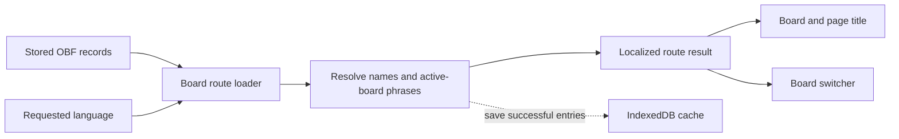

**Board localization: diagnosis and design review**

September 5, 2026 · For the AAC Board AI maintainer · Repository baseline `f9cea765`

The switcher bug exposes a mismatch in data ownership. The active board is a
localized route result; the switcher is an independently loaded storage snapshot.
They represent the same board names but have different translation and refresh
rules. My recommendation is to make both projections come from one route-owned
result, backed by phrase-level translation resolution. This fits the existing
architecture with the least additional machinery.

That recommendation has a boundary: a route that awaits translation adds latency.
If the product requires every board to render before any AI work completes, choose
the reactive alternative below from the outset. These are different interaction
contracts, and neither should be hidden inside an incidental hook refactor.

This is a research proposal, not an implementation. It preserves the existing
single communication-language preference and prioritizes accessibility, offline
reliability, and privacy. Findings below distinguish code evidence, external
constraints, and proposed policy.

**The failure has two independent causes.**

On a language change, the app revalidates its route loaders. The board loader
hydrates the active board, translates it, and returns the localized result. The
resolver includes the board name in that work and starts a best-effort cache write
without awaiting it. The page title and grid's accessible name therefore receive
the new name. See the [language-change revalidation](../src/app/routing/use-revalidate-board-on-language-change.ts#L7),
[loader](../src/app/routing/loaders/board-loader.ts#L25),
[resolver](../src/features/board/translation/resolve-board-for-language.ts#L31),
[page](../src/pages/board-page.tsx#L4), and
[grid label](../src/features/board/communication-board.tsx#L149).

The switcher follows a different path. `useBoardsInSet` reads all stored board
records when the set changes, then looks for already stored translations during
render. It never requests missing translations. Its async dependencies contain
only `setId`, and there is no notification when translation writes finish. A
language change rerenders this hook but reuses its old records. See
[the complete hook](../src/features/board/navigation/use-boards-in-set.ts#L17) and
[the storage write](../src/features/board/storage/board-content-storage.ts#L47).

Consequently, unvisited boards never get translated through this path, and even
the active board's newly translated name can remain stale in the switcher.
Adding `language` to the read dependencies addresses neither problem completely:
it still cannot generate missing names, and the read can precede the asynchronous
cache write. Awaiting that write also would not refresh an existing snapshot.

There is already a reactive board-set catalog, but it covers imports and deletions
of sets, not these per-board translation updates. Reusing its name does not make
it the right owner. See [catalog lifecycle](../src/features/board/board-sets/board-sets-store.ts).

**A names-only patch would encounter deeper correctness problems.**

| Finding                                                             | Evidence                                                                                           | Consequence                                                                                                                    |
| ------------------------------------------------------------------- | -------------------------------------------------------------------------------------------------- | ------------------------------------------------------------------------------------------------------------------------------ |
| Any locale dictionary counts as a translated board                  | `findTranslatedBoard` returns a board whenever it finds a map, even an empty one                   | Caching `{ Food: "Comida" }` first would suppress later AI translation of that board's tiles                                   |
| Same-locale writes replace the whole dictionary                     | `updateBoardStrings` assigns `[language]: translations`; a test explicitly expects replacement     | Independent title and tile jobs could erase each other's cached entries                                                        |
| Source and displayed text share the same `Board` type               | `applyTranslations` replaces text while retaining `locale` and the original-key dictionary         | A localized board is indistinguishable from source input; translating it again can translate already translated wording        |
| Source language is assumed and reduced                              | Missing locale becomes English; matching takes the first dictionary with the same primary language | Unknown-language boards may be translated under a false assumption; authored locale variants have no explicit preference order |
| The current resolver discards all fresh results if one phrase fails | `translatePhrases` uses `Promise.all`; its caller falls back to the source board                   | Expanding a single all-or-nothing batch to an entire set increases the failure surface                                         |

These are directly visible in [translation helpers](../src/features/board/translation/board-translations.ts),
[resolution](../src/features/board/translation/resolve-board-for-language.ts#L54),
[storage](../src/features/board/storage/board-content-storage.ts#L63), and
[replacement coverage](../src/features/board/storage/board-content-storage.test.ts).
They are code-derived failure cases; I did not run a new failing end-to-end
reproduction for each one.

The current loader rehydrates source content on each run, so it already avoids
chaining translations through a previously localized board. That type ambiguity
is a risk for the redesign, not evidence that chained translation causes today's
switcher bug.

**The useful model is source content plus translations, projected for a language.**

Keep board identity, source content, and presentation conceptually distinct:

| Concern             | Suggested rule                                                                                                       |
| ------------------- | -------------------------------------------------------------------------------------------------------------------- |
| Identity            | Keep `(setId, boardId)`, button IDs, links, and grid order independent of wording                                    |
| Source content      | Retain imported names, labels, vocalizations, locale, and supplied dictionaries                                      |
| Translation results | Resolve individual missing entries for a requested locale; generated results remain derived content                  |
| Presentation        | Compute the displayed board and switcher names from the same resolved entries                                        |
| Persistence         | Save successful results for future loads; the currently displayed result must not depend on a successful cache write |

React's guidance to avoid duplicate state and derive values from their owners
supports this arrangement. It does not mandate a store, provider, or particular
folder structure. [React: Choosing the State Structure](https://react.dev/learn/choosing-the-state-structure).

The smallest shared capability is a board-specific phrase resolver used by a
board-content operation and a board-name operation. Both should share source
resolution, locale matching, missing-entry detection, and merge policy. Neither
needs to hydrate another board's media just to translate its name. Existing
`listBoards` does read full OBF records, so returning summaries reduces what
consumers receive, not the current IndexedDB read cost. See
[listBoards](../src/features/board/storage/board-content-storage.ts#L28) and
[media hydration](../src/features/board/storage/board-hydration.ts#L25).

A resolver should apply supplied target entries first, use cached generated
entries for remaining keys, attempt eligible missing translations, and retain
source wording for unresolved fields. Completeness means coverage of the fields
requested by this operation. A name-only request and a full-board request have
different coverage; neither requires a persisted `isTranslated` flag.

Merge new entries inside the existing read/write transaction, preserving values
already present for those keys. This prevents overlapping missing-entry jobs from
clobbering each other. Keep successes when unrelated phrases fail; cancellation
must still prevent obsolete results from becoming the current view. Use own-key
checks for imported dictionary entries, and do not infer failure merely because
a translation equals its input: proper names can legitimately stay unchanged.

Imported and generated entries currently occupy the same `obf.strings` map,
without provenance. A compatible first implementation can retain that storage
arrangement and preserve existing values while adding only missing entries.
Physical co-location does not require treating generated text as canonical.
It does mean existing entries cannot reliably be classified as authored or
machine-generated. If review, selective regeneration, or export becomes a real
requirement, introduce a separate generated cache then; its schema and migration
would be an explicit follow-up decision.

**OBF adds one important wrinkle: dictionary keys are not always words.**

OBF string lists map button label and vocalization attribute values to localized
strings. Its example includes `label: ":time"` with an English dictionary value
of `"time"`. Resolve that source wording before AI translation, but retain
`:time` as the dictionary lookup key. The current source-language early return
does not perform this resolution. The specification permits partial dictionaries
and leaves broader locale fallback to the application. See the installed
1.3.5 [OBF specification copy](../node_modules/@shayc/open-board-format/docs/external/open-board-format.md#L341).

That specification explicitly describes button labels and vocalizations; it does
not explicitly standardize board-name translation. Using the name as another
dictionary key is an existing app convention. It can remain for compatibility,
but it is not a guarantee that other OBF readers will localize titles. Preserve
label and vocalization as separate fields: one can be a short symbol label and
the other a complete utterance. See [vocalization semantics](../node_modules/@shayc/open-board-format/docs/external/open-board-format.md#L210).

Similarly, when an imported board has no name, its stored fallback is the board
ID. Show that fallback without submitting the identifier to AI. See
[imported names](../src/features/board/import/board-import.ts#L129).

The existing string-key model is adequate for this repair. It cannot express two
different translations of the same source key in one board. A field-addressed
cache would help only if contextual translation or human overrides require that
distinction. Do not introduce one merely to translate a title, and do not merge
all boards into a global dictionary that loses their source languages and context.

**Three coherent solutions are worth considering.**

| Solution                              | Runtime owner                                            | Main advantage                                                     | Main cost                                                                               | Best fit                                         |
| ------------------------------------- | -------------------------------------------------------- | ------------------------------------------------------------------ | --------------------------------------------------------------------------------------- | ------------------------------------------------ |
| A. One localized route snapshot       | Existing active-board route loader                       | Board, title, and switcher agree without another reactive store    | Translation of visible content contributes to navigation/revalidation latency           | Current architecture, with bounded optional work |
| B. Reactive translation overlay       | One board-feature owner shared by the board and switcher | Source content renders while translations improve the view         | Subscriptions, task lifetime, and progressive-update policy become app responsibilities | Strict rendering before AI completes             |
| C. Prepare a board set for a language | Explicit preparation operation, then cache-based reads   | Predictable coverage across the set and useful offline preparation | Upfront work, progress/retry UI, and a completion refresh contract                      | Repeated use of a known set in another language  |

**A. Extend the existing route result to include localized board summaries.**

Have one loader orchestration read the set's names and hydrate the active board.
Resolve all real names plus the active board's labels/vocalizations through the
same phrase policy. Reuse the active board's resolved name when producing both
views. Return the requested language with the result so its identity remains
explicit during a subsequent language change.

At the app composition boundary, read the existing board route's result and pass
its summaries into `BoardSelector`. Keep the route ID dependency in `app/`,
consistent with feature boundaries. React Router provides `useRouteLoaderData`
for identified routes. The selector remains responsible for selection, filtering,
and keyboard interaction; its independent storage-loading hook can disappear.
[React Router: useRouteLoaderData](https://reactrouter.com/api/hooks/useRouteLoaderData),
[current header](../src/app/shell/app-header.tsx#L66).

Use a single orchestration point rather than assuming a parent loader finishes
translation before a child reads its cache. Keep the existing provisional media
lifecycle and abort handling. Route cancellation helps protect which result is
rendered; cache writes still need their own merge and source-identity checks.
[React Router: Race Conditions](https://reactrouter.com/explanation/race-conditions).

For a set with N named boards and P active-board phrases, this requests at most
N + P strings before cache reuse and deduplication, instead of every tile on every
board. Hydrate media only for the active board. Group requests by source/target
language where useful, using a scoped translator rather than a permanent pool.

The tradeoff is real: uncached names add work to a route that already waits for
AI. Restrict automatic work to prepared pairs, bound the overall optional wait,
and return source/cached results if it cannot finish. A deadline is a latency
budget, not immediate rendering. Do not choose an arbitrary numeric budget
without trying representative sets. If this bounded delay is unacceptable,
solution B is the appropriate design.

Preparation must happen from a suitable user action, using already known source
language pairs, followed by revalidation after readiness. A loader reached after
asynchronous storage work cannot reliably inherit a usable activation. Failed or
unsupported preparation must leave the existing board usable. This adds a
preparation/retry path, not another board-data owner.

**B. Keep source boards loader-owned and publish translations through one overlay.**

The loader returns hydrated source content without waiting for inference. A
single feature-local owner holds resolved phrase maps for the active set and
requested language. Both board presentation and board summaries derive from it.
Successful translations update this owner immediately; persistence follows.
This makes AI independent of navigation latency.

Start with a provider scoped around the board and header, or the repository's
existing external-store primitive if imperative access is genuinely needed.
Choose one. Store source references and translation entries, then derive the
displayed board; avoid separately storing synchronized copies of the translated
board, selected title, and every label. Scope entries by set, board, source, and
target language. Track only pending work required to cancel or avoid duplicate
requests; do not build a general job scheduler.

This solution needs explicit behavior for leaving a set, rapid language changes,
failed persistence, and source replacement. Detach obsolete consumers and reject
stale view commits. Whether valid completed results may still enter their own
locale cache is a policy independent of whether they may update the screen.
Deletion must not resurrect records, and reimport under a reused ID must not
accept results for different source content.

The installed AI library already shares instances among hooks with identical
options and owns their preparation/disposal. It does not cache board phrases.
Its imperative `createTranslator` path creates standalone instances instead.
Reuse the appropriate path without adding a second generic lifecycle registry.
See the installed [registry](../node_modules/@shayc/react-built-in-ai/dist/index.mjs#L75),
[imperative path](../node_modules/@shayc/react-built-in-ai/dist/index.mjs#L279), and
[hook implementation](../node_modules/@shayc/react-built-in-ai/dist/index.mjs#L647).

This is the strongest option if AI must never delay a newly opened board. Its
extra state has a purpose, but changing the active board from a final loader
result to a progressively localized view revises a documented architectural
invariant. That is broader than fixing the switcher alone.

**C. Explicitly prepare translations for the whole set.**

An operation associated with a language/preparation action translates the set's
missing content, displays progress, persists successful entries, and retains
source access throughout. Runtime views use the shared cache-based projection.
Resolve names first, then the active board, then remaining boards. Read OBF text
without creating media URLs for inactive boards.

This makes sense when a person will repeatedly use the same set in the target
language and wants its content prepared before going offline. Interrupted work
can resume by checking missing entries; no second persisted completion flag is
needed. Do not make changing the UI language wait for whole-set preparation.

Completion must refresh the shared presentation owner, including the list. Merely
writing IndexedDB repeats today's bug. Retain fresh results in the current
session even if saving fails; failed persistence means preparation will not be
durable after reload.

This option trades greater upfront work and progress controls for predictable
coverage. It does not ensure perfect machine translation or prevent storage
eviction. Preparation is also a scheduling choice that can be added to A or B;
it does not independently solve data ownership. I would not require it for the
initial repair.

**Language and accessibility rules must survive fallback.**

Keep one communication-language setting, but distinguish the requested language,
the UI catalog actually selected, the source locale, and the language of each
resolved piece of content. These are internal facts, not four new settings.
Today the UI falls back to its base catalog while the document language follows
the requested language. Translated boards also retain their source `locale`.
See [UI fallback](../src/shared/language/language-store.ts#L37),
[document language](../src/shared/language/language-provider.tsx#L15), and
[text projection](../src/features/board/translation/board-translations.ts#L45).

For switcher summaries, carrying `nameLanguage` beside `name` is sufficient if
that is the consumer's need. Do not relabel an entire partially translated board
as the target language. If field-level language becomes necessary for board
markup or playback, return it from the same resolver rather than inferring it
from string equality. WCAG's language-of-parts criterion has exceptions for
proper names, technical terms, and indeterminate-language wording; it does not
require guessing a language for every identifier.
[W3C: Language of Parts](https://www.w3.org/WAI/WCAG22/Understanding/language-of-parts.html).

Preserve canonical locale tags and prefer an exact authored match before an
explicit compatible fallback. Do not indiscriminately collapse script distinctions
such as `zh-Hans` and `zh-Hant`. The Translator draft uses best-fit matching, but
the app still owns dictionary fallback; these are separate decisions. Unknown
source language should remain unknown unless supported by import metadata or
another deliberate source-language policy. Avoid adding automatic detection just
to repair this switcher. [Translator API draft, August 10, 2026](https://webmachinelearning.github.io/translation-api/#translator-availability).

Keep selected and highlighted options attached to board IDs as names change.
The current selector already keys and compares options by ID. Preserve its search
text and keyboard target when applying new results. Prefer one name batch update;
if updates arrive progressively, avoid re-sorting after each completion, and defer
order changes while the popup is being used. This is a proposed AAC interaction
policy, not a claim that WCAG prohibits locale-sensitive sorting.
See [selector identity](../src/features/board/navigation/board-selector.tsx#L30).

Apply known content language to fallback text and isolate mixed-direction titles
with appropriate `dir`/`bdi` markup. Text direction should not silently change
board identity or tile placement. Accessible labels that mention a translated
title must use the same resolved wording as the visible title. Application
vocalization can still differ from a tile's visible label.
[W3C: Bidirectional Text](https://www.w3.org/International/articles/inline-bidi-markup/),
[W3C: Label in Name](https://www.w3.org/WAI/WCAG22/Understanding/label-in-name).

The wider audit also found raw board-set names/descriptions in library surfaces
and a playback path that prefers recorded audio over text. Those deserve explicit
product decisions: an imported collection title may be a proper name, and
translating a label does not translate its recording. They should not become
accidental behavior changes in this repair. See
[library names](../src/features/board/board-sets/board-set-list.tsx#L79),
[details](../src/features/board/board-sets/board-set-details-dialog.tsx), and
[playback planning](../src/features/board/playback/plan-playback.ts#L30).

**Browser constraints shape all three solutions.**

Chrome documents language packs downloaded on demand and sequential translation
processing. Pair availability is distinct from the existence of the API and can
be privacy-masked until the site creates a translator. Large speculative batches
can therefore delay useful text. `Promise.all` is not evidence of parallel
inference. [Chrome: Translation with Built-in AI](https://developer.chrome.com/docs/ai/translator-api),
displayed update May 20, 2025; accessed September 5, 2026.

The installed `@shayc/react-built-in-ai` 0.11.5 requires transient activation to
start a `downloadable` pair and permits joining an existing download. Its hooks
expose preparation/retry behavior. Validate cold-download behavior on the target
browser rather than assuming a language-change effect is enough. See
[provisioning](../node_modules/@shayc/react-built-in-ai/dist/index.mjs#L254) and
[hook lifecycle](../node_modules/@shayc/react-built-in-ai/dist/index.mjs#L390).

Chrome's implementation documents browser-local models; the broader API proposal
allows cloud implementations and gives no translation-quality guarantee. Preserve
the project's local-only integration policy and do not infer a universal privacy
guarantee merely from `Translator` being present. No server fallback is proposed.
[Chrome Translator documentation](https://developer.chrome.com/docs/ai/translator-api),
[Translator proposal goals](https://github.com/webmachinelearning/translation-api#goals).

**Recommended implementation sequence.**

1. Correct phrase resolution: source dictionary lookup, deterministic target
   fallback, missing-entry coverage, and safe same-locale merging. Preserve known
   values and translate only missing real text.
2. Implement A as one localized route result covering the active board and all
   switcher names. Feed the selector through the app composition boundary and
   remove its independent storage snapshot.
3. Make readiness and the optional wait policy explicit. Add gesture-based
   preparation/retry with revalidation, and retain source/cached content when
   translation cannot proceed. If any AI wait is unacceptable, select B before
   implementing this step rather than gradually building an unnamed second owner.
4. Verify language transitions and keyboard stability in the full application
   tree, then update the architecture document to match the chosen contract.

No new dependency, general localization framework, global phrase dictionary,
translator pool, full-set media hydration, or import/export redesign is justified
by this bug. Keep storage access in `storage/`, domain policy in `translation/`,
and route composition in `app/`. The implementation should remove an ownership
split, not add wrappers around it.

**Acceptance checks should demonstrate the missing behavior.**

| Scenario                                                   | Observable result                                                                                                           |
| ---------------------------------------------------------- | --------------------------------------------------------------------------------------------------------------------------- |
| Switch language on a multi-board set with no cache         | Active and unvisited board names translate; the selected ID and current route remain stable                                 |
| Only a name is cached, then open that board                | Missing labels and vocalizations still translate; existing wording is retained                                              |
| Supplied target entries and source dictionary tokens       | Supplied text wins; AI receives resolved source wording rather than token keys                                              |
| Rapid language changes, then late completion               | Earlier results cannot overwrite the latest view or restore the wrong list                                                  |
| Unsupported API, model not ready, or translation failure   | Source/cached names remain selectable; available successful translations are retained according to the chosen commit policy |
| Translate title and tile entries concurrently, then reload | Cache entries survive together; the reloaded view needs no successful new inference for cached text                         |
| Persistence failure                                        | Fresh translations remain visible in the current result; core navigation remains usable                                     |
| Duplicate translated names and an open filtered popup      | Selection, highlight, search input, and Enter still target the intended board ID                                            |
| Mixed source locales, RTL fallback, missing names          | Known language/direction are represented correctly; board IDs are not sent for translation                                  |
| Delete/reimport or abort during work                       | Old work cannot revive deleted content, contaminate a replacement, or leak provisional media                                |

Use real IndexedDB, routing, providers, and interactions. Stub only the absent
browser AI boundary and allowed nondeterminism/device output. Resolve controlled
promises to exercise ordering without sleeps. These checks target behavior, not
whether a helper was called.

**Verification and limits.**

The six existing suites for the selector, translation helpers/resolver, content
storage, language revalidation, and board loader passed: **32 tests**. The selector
suite covers cached names before mounting, not switching language with missing AI
translations. The storage suite confirms today's replacement behavior. Passing
these tests establishes the inspected baseline; it does not establish that the
reported bug is fixed.

The delivered Markdown received a full text review, formatting checks, and
validation that every local source link and referenced line exists. Its diagram
was reviewed as source; no rendered visual or screen-reader review was performed.

Research covered repository code, tests, installed OBF 1.3.5 and Built-in AI
0.11.5 sources, React/Router documentation, Chrome documentation, the Translator
draft/proposal, and W3C accessibility guidance. External sources were accessed
September 5, 2026. The live OBF documentation embeds a Google document whose
contents could not be fetched; OBF semantics here rely on the specification copy
shipped with the installed dependency, not an independently verified current
remote revision.

No real model translation quality, cold-download latency, large-set performance,
or screen-reader language switching was measured. These are the remaining
empirical checks that could change the choice between A and B. Discovery stopped
after the ownership failure, format semantics, browser constraints, and viable
alternatives had primary or local evidence; further general framework research
would not resolve those product-specific measurements.
